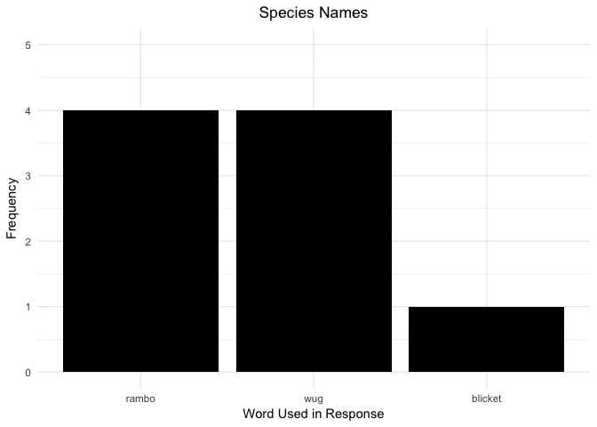

Critter Game - Data - Text Analysis
================
Lauren Oey
7/7/2017

``` r
library(dplyr)
```

    ## 
    ## Attaching package: 'dplyr'

    ## The following objects are masked from 'package:stats':
    ## 
    ##     filter, lag

    ## The following objects are masked from 'package:base':
    ## 
    ##     intersect, setdiff, setequal, union

``` r
library(tidyr)
library(ggplot2)
library(data.table)
```

    ## 
    ## Attaching package: 'data.table'

    ## The following objects are masked from 'package:dplyr':
    ## 
    ##     between, first, last

``` r
library(tidytext)

#setting the directory
setwd("../mturk/game-1/")


text_data <- read.csv("game-1-trials.csv")

reorder_size <- function(x) {
  factor(x, levels = names(sort(table(x), decreasing = TRUE)))
}

#View(text_data)

str(text_data)
```

    ## 'data.frame':    18 obs. of  4 variables:
    ##  $ workerid  : int  0 1 2 3 4 5 6 7 8 9 ...
    ##  $ trial_type: Factor w/ 1 level "chatbox": 1 1 1 1 1 1 1 1 1 1 ...
    ##  $ response  : Factor w/ 18 levels "Certain species will have not heave feathers on their  head if they have pepsin in the body (blicket) - others like the Lug hav"| __truncated__,..: 17 4 16 18 2 5 15 13 1 9 ...
    ##  $ condition : Factor w/ 2 levels "label_book","pepsin_detector": 2 2 2 1 1 1 2 1 2 2 ...

``` r
summary(text_data)
```

    ##     workerid       trial_type
    ##  Min.   : 0.00   chatbox:18  
    ##  1st Qu.: 4.25               
    ##  Median : 8.50               
    ##  Mean   : 8.50               
    ##  3rd Qu.:12.75               
    ##  Max.   :17.00               
    ##                              
    ##                                                                                                                                                                                                                                                                                                                                                  response 
    ##  Certain species will have not heave feathers on their  head if they have pepsin in the body (blicket) - others like the Lug have feathers on their head if there is no pepsin in the bones                                                                                                                                                          : 1  
    ##  I believe if a critter has pespin in it&quotechars bones it will not have a tail or feathers on it&quotechars head.                                                                                                                                                                                                                                 : 1  
    ##  I see no correlation between Pepsin and anything. Good luck.                                                                                                                                                                                                                                                                                        : 1  
    ##  If the creature doesn&quotechart have a tail, it is likely to have pepsin in its bones. If it doesn&quotechart have feathers on its head it is likely to have pepsin in its bones too.                                                                                                                                                              : 1  
    ##  Most will not have peppin in their bones but just a few will.  It&quotechars very hard to tell which ones will, I didn&quotechart really notice any patterns.  The only advice I could offer because the researcher seemed to put an importance on this in my questions is to pay attention to the feathers on the head and if it has tail feathers.: 1  
    ##  no pepsin = no tail or head feathers                                                                                                                                                                                                                                                                                                                : 1  
    ##  (Other)                                                                                                                                                                                                                                                                                                                                             :12  
    ##            condition 
    ##  label_book     : 8  
    ##  pepsin_detector:10  
    ##                      
    ##                      
    ##                      
    ##                      
    ## 

``` r
# Adjusting MechTurk/Punctuation Errors
text_df <- data_frame(line = 1:18, condition=text_data[,4], text=text_data[,3])
text_df$text <- gsub("&quotechar", "'", text_df$text)
text_df$text <- gsub("DON'T.NONE", "DON'T. NONE", text_df$text)
text_df$text <- as.character(text_df$text)
```

Both Conditions Combined
========================

Tokenize Sentences
------------------

``` r
tokenized <- text_df %>%
  unnest_tokens(word, text) # #convert sentence string to tokens
tokenized
```

    ## # A tibble: 459 x 3
    ##     line       condition      word
    ##    <int>          <fctr>     <chr>
    ##  1     1 pepsin_detector     these
    ##  2     1 pepsin_detector     birds
    ##  3     1 pepsin_detector      like
    ##  4     1 pepsin_detector creatures
    ##  5     1 pepsin_detector       all
    ##  6     1 pepsin_detector      have
    ##  7     1 pepsin_detector different
    ##  8     1 pepsin_detector  features
    ##  9     1 pepsin_detector      some
    ## 10     1 pepsin_detector        of
    ## # ... with 449 more rows

All Words Count
---------------

``` r
count_all_words <- tokenized %>%
  count(word, sort=TRUE)
count_all_words
```

    ## # A tibble: 147 x 2
    ##        word     n
    ##       <chr> <int>
    ##  1     have    27
    ##  2      the    20
    ##  3     some    19
    ##  4      and    17
    ##  5 feathers    17
    ##  6     head    13
    ##  7   pepsin    13
    ##  8       in    12
    ##  9       on    11
    ## 10       to    11
    ## # ... with 137 more rows

Quantifiers Word Count
----------------------

``` r
quantifier_words = c("all","each","most","many","some","few","none")
# no "every","a lot"

quantifiers <- count_all_words[c(count_all_words$word %in% quantifier_words),]
quantifiers
```

    ## # A tibble: 7 x 2
    ##    word     n
    ##   <chr> <int>
    ## 1  some    19
    ## 2   all     3
    ## 3   few     2
    ## 4  most     2
    ## 5  none     2
    ## 6  each     1
    ## 7  many     1

``` r
quantifier_count <- ggplot(quantifiers, aes(x=word, y=n)) +
  geom_bar(stat="identity", fill="black") +
  scale_x_discrete("Word Used in Response", limits=c(quantifier_words)) +
  scale_y_continuous("Frequency", limits=c(0,20)) + 
  ggtitle("Quantifiers") +
  theme_minimal() +
  theme(plot.title = element_text(hjust=0.5))

quantifier_count
```


Probabilistic Word Count
------------------------

``` r
probability_words = c("always","usually","often","likely","sometimes","never")

probabilities <- count_all_words[c(count_all_words$word %in% probability_words),]
probabilities
```

    ## # A tibble: 2 x 2
    ##     word     n
    ##    <chr> <int>
    ## 1 likely     2
    ## 2  often     2

``` r
probability_count <- ggplot(probabilities, aes(x=word, y=n)) +
  geom_bar(stat="identity", fill="black") +
  scale_x_discrete("Word Used in Response", limits=c(probability_words)) +
  scale_y_continuous("Frequency", limits=c(0,5)) + 
  ggtitle("Probabilistic Words") +
  theme_minimal() +
  theme(plot.title = element_text(hjust=0.5))

probability_count
```


Conditionals Word Count
-----------------------

``` r
conditional_words = c("if","when","while")

conditionals <- count_all_words[c(count_all_words$word %in% conditional_words),]
conditionals
```

    ## # A tibble: 1 x 2
    ##    word     n
    ##   <chr> <int>
    ## 1    if     6

``` r
conditional_count <- ggplot(conditionals, aes(x=word, y=n)) +
  geom_bar(stat="identity", fill="black") +
  scale_x_discrete("Word Used in Response", limits=c(conditional_words)) +
  scale_y_continuous("Frequency", limits=c(0,10)) + 
  ggtitle("Conditionals") +
  theme_minimal() +
  theme(plot.title = element_text(hjust=0.5))

conditional_count
```


Context Word Count
------------------

``` r
count_context_words <- tokenized %>%
  anti_join(stop_words) %>% #remove function words
  count(word, sort=TRUE)
```

    ## Joining, by = "word"

``` r
count_context_words
```

    ## # A tibble: 57 x 2
    ##        word     n
    ##       <chr> <int>
    ##  1 feathers    17
    ##  2     head    13
    ##  3   pepsin    13
    ##  4    bones     8
    ##  5     tail     8
    ##  6    tails     6
    ##  7    birds     4
    ##  8  species     4
    ##  9   colors     3
    ## 10     luck     3
    ## # ... with 47 more rows

``` r
# first 15 words - no change to singular/plural
context_count_unfiltered <- ggplot(count_context_words[1:15,], aes(x=word, y=n)) +
  geom_bar(stat="identity", fill="black") +
  scale_x_discrete("Word Used in Response", limits=c(count_context_words$word[1:15])) +
  scale_y_continuous("Frequency", limits=c(0,18)) + 
  ggtitle("Context Words - Unfiltered") +
  theme_minimal() +
  theme(axis.text.x=element_text(angle=60, hjust=1),
        plot.title = element_text(hjust=0.5))

context_count_unfiltered
```


Convert Plural Nouns to Singular Nouns
--------------------------------------

``` r
#changing plural to singular
text_noPlurals <- text_df
text_noPlurals$text <- gsub("feathers", "feather", text_noPlurals$text, ignore.case=TRUE)
text_noPlurals$text <- gsub("bones", "bone", text_noPlurals$text)
text_noPlurals$text <- gsub("creatures", "creature", text_noPlurals$text)
text_noPlurals$text <- gsub("critters", "critter", text_noPlurals$text)
text_noPlurals$text <- gsub("features", "feature", text_noPlurals$text)
text_noPlurals$text <- gsub("birds", "bird", text_noPlurals$text)
text_noPlurals$text <- gsub("colors", "color", text_noPlurals$text)
text_noPlurals$text <- gsub("tails", "tail", text_noPlurals$text, ignore.case=TRUE)
text_noPlurals$text <- gsub("heads", "head", text_noPlurals$text)
text_noPlurals$text <- gsub("wugs", "wug", text_noPlurals$text, ignore.case=TRUE)
text_noPlurals$text <- gsub("blickets", "blicket", text_noPlurals$text)
text_noPlurals$text <- gsub("rambos", "rambo", text_noPlurals$text, ignore.case=TRUE)
text_noPlurals$text <- gsub("peppin", "pepsin", text_noPlurals$text)
text_noPlurals$text <- gsub("pespin", "pepsin", text_noPlurals$text)
text_noPlurals$text <- gsub("pebcide", "pepsin", text_noPlurals$text)
text_noPlurals$text <- gsub("sizes", "size", text_noPlurals$text)
text_noPlurals$text <- gsub("types", "type", text_noPlurals$text)


tokenized_noPlurals <- text_noPlurals %>%
  unnest_tokens(word, text)

count_context_words_noPlurals <- tokenized_noPlurals %>%
  anti_join(stop_words) %>%
  count(word, sort=TRUE)
```

    ## Joining, by = "word"

``` r
count_context_words_noPlurals
```

    ## # A tibble: 48 x 2
    ##       word     n
    ##      <chr> <int>
    ##  1 feather    17
    ##  2  pepsin    16
    ##  3    tail    14
    ##  4    head    13
    ##  5    bone     8
    ##  6    bird     4
    ##  7   rambo     4
    ##  8 species     4
    ##  9     wug     4
    ## 10   color     3
    ## # ... with 38 more rows

``` r
# first 15 words - w/ change to singular/plural
context_count_filtered <- ggplot(count_context_words_noPlurals[1:15,], aes(x=word, y=n)) +
  geom_bar(stat="identity", fill="black") +
  scale_x_discrete("Word Used in Response", limits=c(count_context_words_noPlurals$word[1:15])) +
  scale_y_continuous("Frequency", limits=c(0,18)) + 
  ggtitle("Context Words - Filtered") +
  theme_minimal() +
  theme(axis.text.x=element_text(angle=60, hjust=1),
        plot.title = element_text(hjust=0.5))

context_count_filtered
```


Category Names
--------------

``` r
# Categories = pepsin, tail, head, species, color, size
category_types = c("pepsin","tail","head","species","color","size")

characteristic_categories <- count_context_words_noPlurals[c(count_context_words_noPlurals$word %in% category_types),]
categories_count <- ggplot(characteristic_categories, aes(x=word, y=n)) +
  geom_bar(stat="identity", fill="black") +
  scale_x_discrete("Word Used in Response", limits=c(characteristic_categories$word[1:6])) +
  scale_y_continuous("Frequency", limits=c(0,18)) + 
  ggtitle("Critter Characteristic") +
  theme_minimal() +
  theme(plot.title = element_text(hjust=0.5))

categories_count
```


Types Within Categories
-----------------------

### Species Categories

``` r
# Species = rambo, wug, blicket
species_types = c("rambo","wug","blicket")
species_categories <- count_context_words_noPlurals[c(count_context_words_noPlurals$word %in% species_types),]
species_count <- ggplot(species_categories, aes(x=word, y=n)) +
  geom_bar(stat="identity", fill="black") +
  scale_x_discrete("Word Used in Response", limits=c(species_categories$word[1:3])) +
  scale_y_continuous("Frequency", limits=c(0,5)) + 
  ggtitle("Species Names") +
  theme_minimal() +
  theme(plot.title = element_text(hjust=0.5))

species_count
```



### Colors Categories

``` r
# Species = rambo, wug, blicket
color_types = c("green","yellow","orange")
color_assignment = c("green" = "forestgreen", "yellow" = "gold", "orange" = "sienna1")
color_categories <- count_context_words_noPlurals[c(count_context_words_noPlurals$word %in% color_types),]
color_count <- ggplot(color_categories, aes(x=word, y=n, fill=word)) +
  geom_bar(stat="identity", colour="black") +
  scale_x_discrete("Word Used in Response", limits=c(color_categories$word[1:3])) +
  scale_y_continuous("Frequency", limits=c(0,5)) + 
  scale_fill_manual(values=color_assignment) +
  ggtitle("Color Descriptors") +
  guides(fill=FALSE) +
  theme_minimal() +
  theme(plot.title = element_text(hjust=0.5))

color_count
```


Analysis By Condition
=====================
