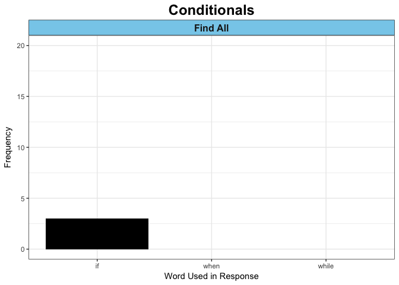
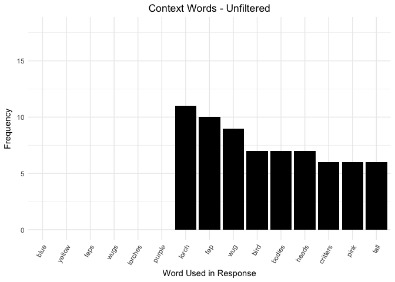
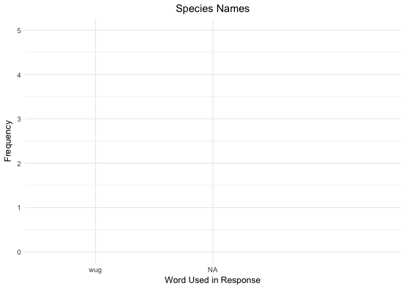

Critter Game - Data - Text Analysis - Experiment 2
================
Lauren Oey
7/7/2017

``` r
library(dplyr)
```

    ## 
    ## Attaching package: 'dplyr'

    ## The following objects are masked from 'package:stats':
    ## 
    ##     filter, lag

    ## The following objects are masked from 'package:base':
    ## 
    ##     intersect, setdiff, setequal, union

``` r
library(tidyr)
library(ggplot2)
library(data.table)
```

    ## 
    ## Attaching package: 'data.table'

    ## The following objects are masked from 'package:dplyr':
    ## 
    ##     between, first, last

``` r
library(tidytext)

#setting the directory
setwd("../mturk/game-2/")


text_data <- read.csv("game-2-trials.csv")

reorder_size <- function(x) {
  factor(x, levels = names(sort(table(x), decreasing = TRUE)))
}

#View(text_data)

str(text_data)
```

    ## 'data.frame':    105 obs. of  7 variables:
    ##  $ workerid       : int  0 0 0 1 1 1 2 2 2 3 ...
    ##  $ trial_type     : Factor w/ 1 level "chatbox": 1 1 1 1 1 1 1 1 1 1 ...
    ##  $ question       : Factor w/ 2 levels "find all of the creatures",..: 2 2 2 2 2 2 1 1 1 2 ...
    ##  $ time_in_seconds: num  12.66 3.34 3.81 38.99 14.57 ...
    ##  $ species        : Factor w/ 3 levels "fep","lorch",..: 2 3 1 1 3 2 3 2 1 2 ...
    ##  $ distribution   : Factor w/ 2 levels "[1,1,0.25]","[1,1,0.5]": 2 2 2 1 1 1 1 1 1 1 ...
    ##  $ response       : Factor w/ 100 levels "All wugs are blue",..: 6 89 19 75 50 49 1 61 9 34 ...

``` r
summary(text_data)
```

    ##     workerid       trial_type                       question 
    ##  Min.   : 0.00   chatbox:105   find all of the creatures:57  
    ##  1st Qu.: 8.00                 find creatures           :48  
    ##  Median :18.00                                               
    ##  Mean   :17.51                                               
    ##  3rd Qu.:27.00                                               
    ##  Max.   :35.00                                               
    ##                                                              
    ##  time_in_seconds    species       distribution
    ##  Min.   :  1.841   fep  :35   [1,1,0.25]:57   
    ##  1st Qu.:  8.392   lorch:35   [1,1,0.5] :48   
    ##  Median : 14.609   wug  :35                   
    ##  Mean   : 20.452                              
    ##  3rd Qu.: 23.799                              
    ##  Max.   :134.727                              
    ##                                               
    ##                                    response 
    ##  None                                  : 3  
    ##  good luck                             : 2  
    ##  It seems to be kind of random honestly: 2  
    ##  Wugs are blue.                        : 2  
    ##  All wugs are blue                     : 1  
    ##  All wugs are blue.                    : 1  
    ##  (Other)                               :94

``` r
# Adjusting MechTurk/Punctuation Errors
text_df <- data_frame(line = 1:105, condition=text_data[,3], distribution=text_data[,6], species=text_data[,5],text=text_data[,7])
text_df$text <- gsub("&quotechar", "'", text_df$text)
#text_df$text <- gsub("DON'T.NONE", "DON'T. NONE", text_df$text)
text_df$text <- as.character(text_df$text)
str(text_df)
```

    ## Classes 'tbl_df', 'tbl' and 'data.frame':    105 obs. of  5 variables:
    ##  $ line        : int  1 2 3 4 5 6 7 8 9 10 ...
    ##  $ condition   : Factor w/ 2 levels "find all of the creatures",..: 2 2 2 2 2 2 1 1 1 2 ...
    ##  $ distribution: Factor w/ 2 levels "[1,1,0.25]","[1,1,0.5]": 2 2 2 1 1 1 1 1 1 1 ...
    ##  $ species     : Factor w/ 3 levels "fep","lorch",..: 2 3 1 1 3 2 3 2 1 2 ...
    ##  $ text        : chr  "Each birds are different colors." "Wugs are blue." "Feps have big heads." "Short bodies are feps.\nNormal bodies are lorch\nand very tall body are wugs. " ...

Tokenize Sentences
==================

``` r
#Tokenize text responses
tokenized <- text_df %>%
  unnest_tokens(word, text) # #convert sentence string to tokens
#tokenized

#Create subset of tokenized data frame by condition
tokenized_findCreat_50 <- subset(tokenized, tokenized$condition=="find creatures" & tokenized$distribution=="[1,1,0.5]")
tokenized_findAll_50 <- subset(tokenized, tokenized$condition=="find all of the creatures" & tokenized$distribution=="[1,1,0.5]")
tokenized_findCreat_25 <- subset(tokenized, tokenized$condition=="find creatures" & tokenized$distribution=="[1,1,0.25]")
tokenized_findAll_25 <- subset(tokenized, tokenized$condition=="find all of the creatures" & tokenized$distribution=="[1,1,0.25]")
```

All Words Count
===============

``` r
#Count of all words
count_all_words <- tokenized %>%
  count(word, sort=TRUE)
count_all_words
```

    ## # A tibble: 160 x 2
    ##       word     n
    ##      <chr> <int>
    ##  1     are    49
    ##  2    blue    25
    ##  3  yellow    25
    ##  4     and    23
    ##  5    feps    22
    ##  6    wugs    22
    ##  7 lorches    20
    ##  8  purple    20
    ##  9     the    16
    ## 10    have    15
    ## # ... with 150 more rows

``` r
#Count of all words in Find Creature & [1,1,0.5] condition
count_all_words_findCreat_50 <- tokenized_findCreat_50 %>%
  count(word, sort=TRUE)
count_all_words_findCreat_50
```

    ## # A tibble: 73 x 2
    ##       word     n
    ##      <chr> <int>
    ##  1     are     9
    ##  2     and     7
    ##  3  yellow     7
    ##  4    blue     6
    ##  5    feps     6
    ##  6    have     6
    ##  7 lorches     6
    ##  8    wugs     6
    ##  9   heads     5
    ## 10      of     5
    ## # ... with 63 more rows

``` r
#Count of all words in Find All Creatures & [1,1,0.5] condition
count_all_words_findAll_50 <- tokenized_findAll_50 %>%
  count(word, sort=TRUE)
count_all_words_findAll_50
```

    ## # A tibble: 39 x 2
    ##       word     n
    ##      <chr> <int>
    ##  1    have     6
    ##  2 lorches     6
    ##  3     are     5
    ##  4     and     4
    ##  5    blue     4
    ##  6    feps     4
    ##  7      be     3
    ##  8  bodies     3
    ##  9     fep     3
    ## 10  longer     3
    ## # ... with 29 more rows

``` r
#Count of all words in Find Creature & [1,1,0.25] condition
count_all_words_findCreat_25 <- tokenized_findCreat_25 %>%
  count(word, sort=TRUE)
count_all_words_findCreat_25
```

    ## # A tibble: 69 x 2
    ##      word     n
    ##     <chr> <int>
    ##  1    are    12
    ##  2    and     6
    ##  3     to     6
    ##  4 yellow     6
    ##  5   feps     4
    ##  6    the     4
    ##  7   wugs     4
    ##  8     be     3
    ##  9  birds     3
    ## 10   blue     3
    ## # ... with 59 more rows

``` r
#Count of all words in Find All Creatures & [1,1,0.25] condition
count_all_words_findAll_25 <- tokenized_findAll_25 %>%
  count(word, sort=TRUE)
count_all_words_findAll_25
```

    ## # A tibble: 87 x 2
    ##      word     n
    ##     <chr> <int>
    ##  1    are    23
    ##  2   blue    12
    ##  3 purple    12
    ##  4    the    11
    ##  5   wugs     9
    ##  6 yellow     9
    ##  7    all     8
    ##  8   feps     8
    ##  9  lorch     8
    ## 10      a     6
    ## # ... with 77 more rows

``` r
count_all_words_byCond <- bind_rows(
  mutate(count_all_words_findCreat_50, condition="Find Creature", distribution="[1,1,0.50]"),
  mutate(count_all_words_findAll_50, condition="Find All", distribution="[1,1,0.25]"),
  mutate(count_all_words_findCreat_25, condition="Find Creature", distribution="[1,1,0.50]"),
  mutate(count_all_words_findAll_25, condition="Find All", distribution="[1,1,0.25]"))
count_all_words_byCond
```

    ## # A tibble: 268 x 4
    ##       word     n     condition distribution
    ##      <chr> <int>         <chr>        <chr>
    ##  1     are     9 Find Creature   [1,1,0.50]
    ##  2     and     7 Find Creature   [1,1,0.50]
    ##  3  yellow     7 Find Creature   [1,1,0.50]
    ##  4    blue     6 Find Creature   [1,1,0.50]
    ##  5    feps     6 Find Creature   [1,1,0.50]
    ##  6    have     6 Find Creature   [1,1,0.50]
    ##  7 lorches     6 Find Creature   [1,1,0.50]
    ##  8    wugs     6 Find Creature   [1,1,0.50]
    ##  9   heads     5 Find Creature   [1,1,0.50]
    ## 10      of     5 Find Creature   [1,1,0.50]
    ## # ... with 258 more rows

Quantifiers Word Count
======================

Both Conditions Combined
------------------------

``` r
quantifier_words = c("all","each","most","many","some","few","none")
# no "every","a lot"

quantifiers <- count_all_words[c(count_all_words$word %in% quantifier_words),]
quantifiers
```

    ## # A tibble: 4 x 2
    ##    word     n
    ##   <chr> <int>
    ## 1   all    10
    ## 2  each     3
    ## 3  none     3
    ## 4  some     2

``` r
quantifier_count <- ggplot(quantifiers, aes(x=word, y=n)) +
  geom_bar(stat="identity", fill="black") +
  scale_x_discrete("Word Used in Response", limits=c(quantifier_words)) +
  scale_y_continuous("Frequency", limits=c(0,20)) + 
  ggtitle("Quantifiers") +
  theme_minimal() +
  theme(plot.title = element_text(hjust=0.5))

quantifier_count
```


By Condition
------------

``` r
quantifiers_byCond <- count_all_words_byCond[c(count_all_words_byCond$word %in% quantifier_words),]
quantifiers_byCond
```

    ## # A tibble: 9 x 4
    ##    word     n     condition distribution
    ##   <chr> <int>         <chr>        <chr>
    ## 1   all     1 Find Creature   [1,1,0.50]
    ## 2  each     1 Find Creature   [1,1,0.50]
    ## 3  none     3      Find All   [1,1,0.25]
    ## 4   all     1 Find Creature   [1,1,0.50]
    ## 5  each     1 Find Creature   [1,1,0.50]
    ## 6  some     1 Find Creature   [1,1,0.50]
    ## 7   all     8      Find All   [1,1,0.25]
    ## 8  each     1      Find All   [1,1,0.25]
    ## 9  some     1      Find All   [1,1,0.25]

``` r
quantifier_count_byCond <- ggplot(quantifiers_byCond, aes(x=word, y=n)) +
  geom_bar(stat="identity", fill="black") +
  scale_x_discrete("Word Used in Response", limits=c(quantifier_words)) +
  scale_y_continuous("Frequency", limits=c(0,15)) + 
  facet_wrap(~condition) +
  ggtitle("Quantifiers") +
  theme_bw() +
  theme(plot.title = element_text(hjust=0.5, size=18, face="bold"),
        strip.background = element_rect(fill="skyblue"),
        strip.text = element_text(size=12, face="bold"))

quantifier_count_byCond
```


By Distribution
---------------

``` r
#quantifiers_byCond <- count_all_words_byCond[c(count_all_words_byCond$word %in% quantifier_words),]
#quantifiers_byCond


quantifier_count_byDistr <- ggplot(quantifiers_byCond, aes(x=word, y=n)) +
  geom_bar(stat="identity", fill="black") +
  scale_x_discrete("Word Used in Response", limits=c(quantifier_words)) +
  scale_y_continuous("Frequency", limits=c(0,15)) + 
  facet_wrap(~distribution) +
  ggtitle("Quantifiers") +
  theme_bw() +
  theme(plot.title = element_text(hjust=0.5, size=18, face="bold"),
        strip.background = element_rect(fill="skyblue"),
        strip.text = element_text(size=12, face="bold"))

quantifier_count_byDistr
```


Probabilistic Word Count
========================

Both Conditions Combined
------------------------

``` r
probability_words = c("always","usually","often","likely","sometimes","never")

probabilities <- count_all_words[c(count_all_words$word %in% probability_words),]
probabilities
```

    ## # A tibble: 2 x 2
    ##      word     n
    ##     <chr> <int>
    ## 1 usually     9
    ## 2  likely     3

``` r
probability_count <- ggplot(probabilities, aes(x=word, y=n)) +
  geom_bar(stat="identity", fill="black") +
  scale_x_discrete("Word Used in Response", limits=c(probability_words)) +
  scale_y_continuous("Frequency", limits=c(0,5)) + 
  ggtitle("Probability Words") +
  theme_minimal() +
  theme(plot.title = element_text(hjust=0.5))

probability_count
```

    ## Warning: Removed 1 rows containing missing values (position_stack).


By Condition
------------

``` r
probabilities_byCond <- count_all_words_byCond[c(count_all_words_byCond$word %in% probability_words),]
probabilities_byCond
```

    ## # A tibble: 3 x 4
    ##      word     n     condition distribution
    ##     <chr> <int>         <chr>        <chr>
    ## 1 usually     3 Find Creature   [1,1,0.50]
    ## 2  likely     3 Find Creature   [1,1,0.50]
    ## 3 usually     6      Find All   [1,1,0.25]

``` r
probability_count_byCond <- ggplot(probabilities_byCond, aes(x=word, y=n)) +
  geom_bar(stat="identity", fill="black") +
  scale_x_discrete("Word Used in Response", limits=c(probability_words)) +
  scale_y_continuous("Frequency", limits=c(0,20)) + 
  facet_wrap(~condition) +
  ggtitle("Probability Words") +
  theme_bw() +
  theme(plot.title = element_text(hjust=0.5, size=18, face="bold"),
        strip.background = element_rect(fill="skyblue"),
        strip.text = element_text(size=12, face="bold"))

probability_count_byCond
```


``` r
# only present in 1 condition
```

Conditionals Word Count
=======================

Both Conditions Combined
------------------------

``` r
conditional_words = c("if","when","while")

conditionals <- count_all_words[c(count_all_words$word %in% conditional_words),]
conditionals
```

    ## # A tibble: 1 x 2
    ##    word     n
    ##   <chr> <int>
    ## 1    if     3

``` r
conditional_count <- ggplot(conditionals, aes(x=word, y=n)) +
  geom_bar(stat="identity", fill="black") +
  scale_x_discrete("Word Used in Response", limits=c(conditional_words)) +
  scale_y_continuous("Frequency", limits=c(0,10)) + 
  ggtitle("Conditionals") +
  theme_minimal() +
  theme(plot.title = element_text(hjust=0.5))

conditional_count
```


By Condition
------------

``` r
conditionals_byCond <- count_all_words_byCond[c(count_all_words_byCond$word %in% conditional_words),]
conditionals_byCond
```

    ## # A tibble: 1 x 4
    ##    word     n condition distribution
    ##   <chr> <int>     <chr>        <chr>
    ## 1    if     3  Find All   [1,1,0.25]

``` r
conditional_count_byCond <- ggplot(conditionals_byCond, aes(x=word, y=n)) +
  geom_bar(stat="identity", fill="black") +
  scale_x_discrete("Word Used in Response", limits=c(conditional_words)) +
  scale_y_continuous("Frequency", limits=c(0,20)) + 
  facet_wrap(~condition) +
  ggtitle("Conditionals") +
  theme_bw() +
  theme(plot.title = element_text(hjust=0.5, size=18, face="bold"),
        strip.background = element_rect(fill="skyblue"),
        strip.text = element_text(size=12, face="bold"))

conditional_count_byCond
```



Context Word Count
==================

Both Conditions Combined
------------------------

``` r
count_context_words <- tokenized %>%
  anti_join(stop_words) %>% #remove function words
  count(word, sort=TRUE)
```

    ## Joining, by = "word"

``` r
count_context_words
```

    ## # A tibble: 86 x 2
    ##       word     n
    ##      <chr> <int>
    ##  1    blue    25
    ##  2  yellow    25
    ##  3    feps    22
    ##  4    wugs    22
    ##  5 lorches    20
    ##  6  purple    20
    ##  7   lorch    11
    ##  8     fep    10
    ##  9     wug     9
    ## 10    bird     7
    ## # ... with 76 more rows

``` r
# first 15 words - no change to singular/plural
context_count_unfiltered <- ggplot(count_context_words[1:15,], aes(x=word, y=n)) +
  geom_bar(stat="identity", fill="black") +
  scale_x_discrete("Word Used in Response", limits=c(count_context_words$word[1:15])) +
  scale_y_continuous("Frequency", limits=c(0,18)) + 
  ggtitle("Context Words - Unfiltered") +
  theme_minimal() +
  theme(axis.text.x=element_text(angle=60, hjust=1),
        plot.title = element_text(hjust=0.5))

context_count_unfiltered
```

    ## Warning: Removed 6 rows containing missing values (position_stack).



By Condition
------------

``` r
#Count of all words in Find Creature & [1,1,0.5] condition
count_context_words_findCreat_50 <- tokenized_findCreat_50 %>%
  anti_join(stop_words) %>% #remove function words
  count(word, sort=TRUE)
```

    ## Joining, by = "word"

``` r
count_context_words_findCreat_50
```

    ## # A tibble: 37 x 2
    ##       word     n
    ##      <chr> <int>
    ##  1  yellow     7
    ##  2    blue     6
    ##  3    feps     6
    ##  4 lorches     6
    ##  5    wugs     6
    ##  6   heads     5
    ##  7  purple     4
    ##  8  colors     3
    ##  9    head     3
    ## 10  random     3
    ## # ... with 27 more rows

``` r
#Count of all words in Find All & [1,1,0.5] condition
count_context_words_findAll_50 <- tokenized_findAll_50 %>%
  anti_join(stop_words) %>% #remove function words
  count(word, sort=TRUE)
```

    ## Joining, by = "word"

``` r
count_context_words_findAll_50
```

    ## # A tibble: 22 x 2
    ##       word     n
    ##      <chr> <int>
    ##  1 lorches     6
    ##  2    blue     4
    ##  3    feps     4
    ##  4  bodies     3
    ##  5     fep     3
    ##  6    pink     3
    ##  7    wugs     3
    ##  8  yellow     3
    ##  9   beaks     2
    ## 10    gold     2
    ## # ... with 12 more rows

``` r
#Count of all words in Find Creature & [1,1,0.25] condition
count_context_words_findCreat_25 <- tokenized_findCreat_25 %>%
  anti_join(stop_words) %>% #remove function words
  count(word, sort=TRUE)
```

    ## Joining, by = "word"

``` r
count_context_words_findCreat_25
```

    ## # A tibble: 32 x 2
    ##       word     n
    ##      <chr> <int>
    ##  1  yellow     6
    ##  2    feps     4
    ##  3    wugs     4
    ##  4   birds     3
    ##  5    blue     3
    ##  6  bodies     3
    ##  7 finding     3
    ##  8    luck     3
    ##  9   shape     3
    ## 10    body     2
    ## # ... with 22 more rows

``` r
#Count of all words in Find All & [1,1,0.5] condition
count_context_words_findAll_25 <- tokenized_findAll_25 %>%
  anti_join(stop_words) %>% #remove function words
  count(word, sort=TRUE)
```

    ## Joining, by = "word"

``` r
count_context_words_findAll_25
```

    ## # A tibble: 46 x 2
    ##       word     n
    ##      <chr> <int>
    ##  1    blue    12
    ##  2  purple    12
    ##  3    wugs     9
    ##  4  yellow     9
    ##  5    feps     8
    ##  6   lorch     8
    ##  7    bird     6
    ##  8     fep     6
    ##  9 lorches     6
    ## 10     wug     6
    ## # ... with 36 more rows

``` r
count_context_words_byCond <- bind_rows(
  mutate(count_context_words_findCreat_50, condition="Find Creature", distribution="[1,1,0.50]"),
  mutate(count_context_words_findAll_50, condition="Find All", distribution="[1,1,0.25]"),
  mutate(count_context_words_findCreat_25, condition="Find Creature", distribution="[1,1,0.50]"),
  mutate(count_context_words_findAll_25, condition="Find All", distribution="[1,1,0.25]"))
count_context_words_byCond
```

    ## # A tibble: 137 x 4
    ##       word     n     condition distribution
    ##      <chr> <int>         <chr>        <chr>
    ##  1  yellow     7 Find Creature   [1,1,0.50]
    ##  2    blue     6 Find Creature   [1,1,0.50]
    ##  3    feps     6 Find Creature   [1,1,0.50]
    ##  4 lorches     6 Find Creature   [1,1,0.50]
    ##  5    wugs     6 Find Creature   [1,1,0.50]
    ##  6   heads     5 Find Creature   [1,1,0.50]
    ##  7  purple     4 Find Creature   [1,1,0.50]
    ##  8  colors     3 Find Creature   [1,1,0.50]
    ##  9    head     3 Find Creature   [1,1,0.50]
    ## 10  random     3 Find Creature   [1,1,0.50]
    ## # ... with 127 more rows

``` r
# first 15 words - no change to singular/plural
context_count_unfiltered <- ggplot(count_context_words_byCond[1:15,], aes(x=word, y=n)) +
  geom_bar(stat="identity", fill="black") +
  scale_x_discrete("Word Used in Response", limits=c(count_context_words_byCond$word[1:15])) +
  scale_y_continuous("Frequency", limits=c(0,18)) + 
  facet_wrap(~condition) +
  ggtitle("Context Words - Unfiltered") +
  theme_minimal() +
  theme(axis.text.x=element_text(angle=60, hjust=1),
        plot.title = element_text(hjust=0.5))

#context_count_unfiltered
```

Convert Plural Nouns to Singular Nouns
======================================

``` r
#changing plural to singular
text_noPlurals <- text_df
text_noPlurals$text <- gsub("feathers", "feather", text_noPlurals$text, ignore.case=TRUE)
text_noPlurals$text <- gsub("bones", "bone", text_noPlurals$text)
text_noPlurals$text <- gsub("creatures", "creature", text_noPlurals$text)
text_noPlurals$text <- gsub("critters", "critter", text_noPlurals$text)
text_noPlurals$text <- gsub("features", "feature", text_noPlurals$text)
text_noPlurals$text <- gsub("birds", "bird", text_noPlurals$text)
text_noPlurals$text <- gsub("colors", "color", text_noPlurals$text)
text_noPlurals$text <- gsub("tails", "tail", text_noPlurals$text, ignore.case=TRUE)
text_noPlurals$text <- gsub("heads", "head", text_noPlurals$text)
text_noPlurals$text <- gsub("wugs", "wug", text_noPlurals$text, ignore.case=TRUE)
text_noPlurals$text <- gsub("blickets", "blicket", text_noPlurals$text)
text_noPlurals$text <- gsub("rambos", "rambo", text_noPlurals$text, ignore.case=TRUE)
text_noPlurals$text <- gsub("peppin", "pepsin", text_noPlurals$text)
text_noPlurals$text <- gsub("pespin", "pepsin", text_noPlurals$text)
text_noPlurals$text <- gsub("pebcide", "pepsin", text_noPlurals$text)
text_noPlurals$text <- gsub("sizes", "size", text_noPlurals$text)
text_noPlurals$text <- gsub("types", "type", text_noPlurals$text)


tokenized_noPlurals <- text_noPlurals %>%
  unnest_tokens(word, text)

count_context_words_noPlurals <- tokenized_noPlurals %>%
  anti_join(stop_words) %>%
  count(word, sort=TRUE)
```

    ## Joining, by = "word"

``` r
count_context_words_noPlurals
```

    ## # A tibble: 82 x 2
    ##       word     n
    ##      <chr> <int>
    ##  1     wug    31
    ##  2    blue    25
    ##  3  yellow    25
    ##  4    feps    22
    ##  5 lorches    20
    ##  6  purple    20
    ##  7    bird    12
    ##  8   lorch    11
    ##  9     fep    10
    ## 10    head    10
    ## # ... with 72 more rows

``` r
# first 15 words - w/ change to singular/plural
context_count_filtered <- ggplot(count_context_words_noPlurals[1:15,], aes(x=word, y=n)) +
  geom_bar(stat="identity", fill="black") +
  scale_x_discrete("Word Used in Response", limits=c(count_context_words_noPlurals$word[1:15])) +
  scale_y_continuous("Frequency", limits=c(0,18)) + 
  ggtitle("Context Words - Filtered") +
  theme_minimal() +
  theme(axis.text.x=element_text(angle=60, hjust=1),
        plot.title = element_text(hjust=0.5))

context_count_filtered
```

    ## Warning: Removed 6 rows containing missing values (position_stack).


Category Names
==============

``` r
# Categories = pepsin, tail, head, species, color, size
category_types = c("pepsin","tail","head","species","color","size")

characteristic_categories <- count_context_words_noPlurals[c(count_context_words_noPlurals$word %in% category_types),]
categories_count <- ggplot(characteristic_categories, aes(x=word, y=n)) +
  geom_bar(stat="identity", fill="black") +
  scale_x_discrete("Word Used in Response", limits=c(characteristic_categories$word[1:6])) +
  scale_y_continuous("Frequency", limits=c(0,18)) + 
  ggtitle("Critter Characteristic") +
  theme_minimal() +
  theme(plot.title = element_text(hjust=0.5))

categories_count
```


Types Within Categories
=======================

Species Categories
------------------

``` r
# Species = rambo, wug, blicket
species_types = c("rambo","wug","blicket")
species_categories <- count_context_words_noPlurals[c(count_context_words_noPlurals$word %in% species_types),]
species_count <- ggplot(species_categories, aes(x=word, y=n)) +
  geom_bar(stat="identity", fill="black") +
  scale_x_discrete("Word Used in Response", limits=c(species_categories$word[1:3])) +
  scale_y_continuous("Frequency", limits=c(0,5)) + 
  ggtitle("Species Names") +
  theme_minimal() +
  theme(plot.title = element_text(hjust=0.5))

species_count
```

    ## Warning: Removed 1 rows containing missing values (position_stack).



Colors Categories
-----------------

``` r
# Species = rambo, wug, blicket
color_types = c("green","yellow","orange")
color_assignment = c("green" = "forestgreen", "yellow" = "gold", "orange" = "sienna1")
color_categories <- count_context_words_noPlurals[c(count_context_words_noPlurals$word %in% color_types),]
color_count <- ggplot(color_categories, aes(x=word, y=n, fill=word)) +
  geom_bar(stat="identity", colour="black") +
  scale_x_discrete("Word Used in Response", limits=c(color_categories$word[1:3])) +
  scale_y_continuous("Frequency", limits=c(0,5)) + 
  scale_fill_manual(values=color_assignment) +
  ggtitle("Color Descriptors") +
  guides(fill=FALSE) +
  theme_minimal() +
  theme(plot.title = element_text(hjust=0.5))

color_count
```

    ## Warning: Removed 1 rows containing missing values (position_stack).


