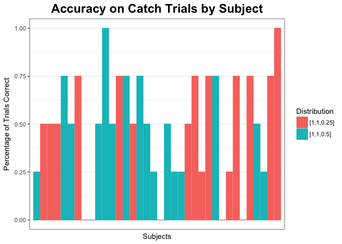

Critter Game - Data - Catch Trial
================
Lauren Oey
7/10/2017

``` r
library(dplyr)
```

    ## 
    ## Attaching package: 'dplyr'

    ## The following objects are masked from 'package:stats':
    ## 
    ##     filter, lag

    ## The following objects are masked from 'package:base':
    ## 
    ##     intersect, setdiff, setequal, union

``` r
library(tidyr)
library(ggplot2)
library(data.table)
```

    ## 
    ## Attaching package: 'data.table'

    ## The following objects are masked from 'package:dplyr':
    ## 
    ##     between, first, last

``` r
# library(xtable)
library(langcog)
```

    ## 
    ## Attaching package: 'langcog'

    ## The following object is masked from 'package:base':
    ## 
    ##     scale

``` r
library(forcats)


# setting the directory
setwd("../../mturk/game-2/")


catch_trial_data <- read.csv("game-2-catch_trials.csv")

# View(catch_trial_data)

str(catch_trial_data)
```

    ## 'data.frame':    576 obs. of  27 variables:
    ##  $ workerid       : int  0 0 0 0 0 0 0 0 0 0 ...
    ##  $ col4_crit      : int  -99 -99 -99 -99 -99 -99 -99 -99 -99 -99 ...
    ##  $ species        : Factor w/ 3 levels "fep","lorch",..: 2 1 3 2 1 3 3 2 1 2 ...
    ##  $ prop2_crit     : Factor w/ 1 level "fatness": 1 1 1 1 1 1 1 1 1 1 ...
    ##  $ trial_num      : int  1 2 3 4 5 6 7 8 9 10 ...
    ##  $ question       : Factor w/ 2 levels "find all of the creatures",..: 2 2 2 2 2 2 2 2 2 2 ...
    ##  $ time_in_seconds: num  6.83 7.75 4.26 4.96 3.88 ...
    ##  $ prop1_crit     : Factor w/ 1 level "height": 1 1 1 1 1 1 1 1 1 1 ...
    ##  $ critter        : Factor w/ 1 level "bird": 1 1 1 1 1 1 1 1 1 1 ...
    ##  $ col1_crit      : Factor w/ 1 level "crest": 1 1 1 1 1 1 1 1 1 1 ...
    ##  $ tar1_crit      : Factor w/ 1 level "tail": 1 1 1 1 1 1 1 1 1 1 ...
    ##  $ tar2_crit      : Factor w/ 1 level "crest": 1 1 1 1 1 1 1 1 1 1 ...
    ##  $ col3_crit      : Factor w/ 1 level "wing": 1 1 1 1 1 1 1 1 1 1 ...
    ##  $ col2_crit      : Factor w/ 1 level "body": 1 1 1 1 1 1 1 1 1 1 ...
    ##  $ distribution   : Factor w/ 2 levels "[1,1,0.25]","[1,1,0.5]": 2 2 2 2 2 2 2 2 2 2 ...
    ##  $ col4           : int  -99 -99 -99 -99 -99 -99 -99 -99 -99 -99 ...
    ##  $ col5           : int  -99 -99 -99 -99 -99 -99 -99 -99 -99 -99 ...
    ##  $ col2           : Factor w/ 16 levels "#4f9eda","#4f9fda",..: 4 14 2 4 14 2 2 11 14 11 ...
    ##  $ col3           : Factor w/ 16 levels "#4f9eda","#4f9fda",..: 4 14 2 4 14 2 2 11 14 11 ...
    ##  $ col1           : Factor w/ 16 levels "#4f9eda","#4f9fda",..: 4 14 2 4 14 2 2 11 14 11 ...
    ##  $ response       : Factor w/ 302 levels "a fep is yellow and has a big head, little body",..: 234 106 287 142 80 287 287 132 104 137 ...
    ##  $ trial_type     : Factor w/ 2 levels "learning_trial",..: 1 1 1 1 1 1 1 1 1 1 ...
    ##  $ prop1          : num  0.662 0.97 0.319 0.114 0.363 ...
    ##  $ prop2          : num  0.018 0.575 0.867 0.542 0.675 ...
    ##  $ col5_crit      : int  -99 -99 -99 -99 -99 -99 -99 -99 -99 -99 ...
    ##  $ tar2           : int  0 0 0 0 0 0 0 0 0 0 ...
    ##  $ tar1           : int  0 0 0 0 0 0 0 0 0 0 ...

``` r
summary(catch_trial_data)
```

    ##     workerid       col4_crit    species      prop2_crit    trial_num    
    ##  Min.   : 0.00   Min.   :-99   fep  :180   fatness:576   Min.   : 1.00  
    ##  1st Qu.: 8.75   1st Qu.:-99   lorch:216                 1st Qu.: 2.75  
    ##  Median :17.50   Median :-99   wug  :180                 Median : 4.50  
    ##  Mean   :17.50   Mean   :-99                             Mean   : 5.50  
    ##  3rd Qu.:26.25   3rd Qu.:-99                             3rd Qu.: 8.25  
    ##  Max.   :35.00   Max.   :-99                             Max.   :12.00  
    ##                                                                         
    ##                       question   time_in_seconds    prop1_crit  critter   
    ##  find all of the creatures:304   Min.   :  1.425   height:576   bird:576  
    ##  find creatures           :272   1st Qu.:  4.658                          
    ##                                  Median :  7.302                          
    ##                                  Mean   : 11.552                          
    ##                                  3rd Qu.: 13.308                          
    ##                                  Max.   :343.704                          
    ##                                                                           
    ##  col1_crit   tar1_crit  tar2_crit   col3_crit  col2_crit      distribution
    ##  crest:576   tail:576   crest:576   wing:576   body:576   [1,1,0.25]:304  
    ##                                                           [1,1,0.5] :272  
    ##                                                                           
    ##                                                                           
    ##                                                                           
    ##                                                                           
    ##                                                                           
    ##       col4          col5          col2          col3          col1    
    ##  Min.   :-99   Min.   :-99   #4f9fda:115   #4f9fda:115   #4f9fda:115  
    ##  1st Qu.:-99   1st Qu.:-99   #eec901: 65   #eec901: 65   #eec901: 65  
    ##  Median :-99   Median :-99   #edc901: 64   #edc901: 64   #edc901: 64  
    ##  Mean   :-99   Mean   :-99   #dc74dc: 62   #dc74dc: 62   #dc74dc: 62  
    ##  3rd Qu.:-99   3rd Qu.:-99   #4f9fdb: 60   #4f9fdb: 60   #4f9fdb: 60  
    ##  Max.   :-99   Max.   :-99   #dd74dd: 50   #dd74dd: 50   #dd74dd: 50  
    ##                              (Other):160   (Other):160   (Other):160  
    ##     response            trial_type      prop1              prop2       
    ##  fep    : 50   learning_trial:432   Min.   :0.003035   Min.   :0.0021  
    ##  lorch  : 50   test_trial    :144   1st Qu.:0.261811   1st Qu.:0.2520  
    ##  wug    : 34                        Median :0.508059   Median :0.4842  
    ##  blue   : 16                        Mean   :0.502610   Mean   :0.5040  
    ##  yellow : 13                        3rd Qu.:0.743413   3rd Qu.:0.7568  
    ##  purple : 11                        Max.   :0.999660   Max.   :0.9990  
    ##  (Other):402                                                           
    ##    col5_crit        tar2        tar1  
    ##  Min.   :-99   Min.   :0   Min.   :0  
    ##  1st Qu.:-99   1st Qu.:0   1st Qu.:0  
    ##  Median :-99   Median :0   Median :0  
    ##  Mean   :-99   Mean   :0   Mean   :0  
    ##  3rd Qu.:-99   3rd Qu.:0   3rd Qu.:0  
    ##  Max.   :-99   Max.   :0   Max.   :0  
    ## 

``` r
catch_test <- subset(catch_trial_data, catch_trial_data$trial_type == "test_trial")
# catch_test$response <- grep(catch_test$response)

summary(catch_test$col1)
```

    ## #4f9eda #4f9fda #4f9fdb #dc74dc #dc74dd #dd74dc #dd74dd #edc800 #edc801 
    ##       1      23      12      18       1       3      14       9       1 
    ## #edc900 #edc901 #edc902 #eec800 #eec900 #eec901 #eec902 
    ##       8      17       6       1      11      16       3

``` r
# catch_test_wug <- subset(catch_test, catch_test$species=='wug' & Correct
# == FALSE)

# wug.color = #4f9fda fep.color = #eec900 lorch.color = #edc901 (yellow) or
# #dc74dc (purple)

purple <- c("#dc74dc", "#dc74dd", "#dd74dc", "#dd74dd")

catch_test$Color <- ifelse(catch_test$species == "wug", "blue", ifelse(catch_test$col1 %in% 
    purple, "purple", "yellow"))

catch_test$Response.edit <- tolower(catch_test$response)


catch_test$Correct <- ifelse(catch_test$species == catch_test$Response.edit, 
    TRUE, FALSE)

# compare correct species to incorrect input
catch_test_errors <- catch_test %>% filter(Correct == FALSE) %>% select(species, 
    Response.edit)
# View(catch_test_errors)

catch_test$Response.cat <- ifelse(catch_test$Response.edit == "wug", "wug", 
    ifelse(catch_test$Response.edit == "fep", "fep", ifelse(catch_test$Response.edit == 
        "lorch", "lorch", "other")))

# data frame structure data.frame( distribution = c( ... ), question = c(
# ... ), targetColor = c('blue', 'yellow', 'purple', 'blue', ... ),
# codedResponse = c('fep', 'lorch', 'other', 'wug', ...) # only four
# categories: fep, lorch, wug, other )


catch_test_reduced <- catch_test %>% select(workerid, trial_num, species, question, 
    distribution, response, Response.cat, Correct, Color)
# View(catch_test_reduced)
```

Proportion Correct By Subject
=============================

``` r
catch_test_reduced_by_subj <- catch_test_reduced %>%
  group_by(workerid, trial_num, question, distribution) %>%
  distinct() %>%
  summarise(Total = 1, Correct_trial = ifelse(Correct==TRUE, 1, 0)) %>%
  group_by(workerid, question, distribution) %>%
  summarise(Total_trials = sum(Total), Correct_trials = sum(Correct_trial)) %>%
  mutate(Percentage_correct = Correct_trials/Total_trials) %>%
  select(workerid, Percentage_correct, question, distribution)

catch_test_reduced_by_subj
```

A tibble: 36 x 4
================

Groups: workerid, question \[36\]
=================================

workerid Percentage\_correct question distribution <int> <dbl> <fctr> <fctr> 1 0 0.25 find creatures \[1,1,0.5\] 2 1 0.50 find creatures \[1,1,0.25\] 3 2 0.50 find all of the creatures \[1,1,0.25\] 4 3 0.50 find creatures \[1,1,0.25\] 5 4 0.75 find all of the creatures \[1,1,0.5\] 6 5 0.50 find creatures \[1,1,0.5\] 7 6 0.75 find all of the creatures \[1,1,0.25\] 8 7 0.00 find creatures \[1,1,0.25\] 9 8 0.00 find all of the creatures \[1,1,0.5\] 10 9 0.50 find creatures \[1,1,0.5\] \# ... with 26 more rows

``` r
graph_by_subj <- ggplot(catch_test_reduced_by_subj, aes(x=workerid, y=Percentage_correct, colour=distribution, fill=distribution)) +
  geom_bar(stat="identity") +
  scale_x_discrete("Subjects") +
  scale_y_continuous("Percentage of Trials Correct") +
  scale_colour_discrete(guide=guide_legend("Distribution")) +
  scale_fill_discrete(guide=guide_legend("Distribution")) +
  #facet_wrap(~distribution) +
  ggtitle("Accuracy on Catch Trials by Subject") +
  theme_bw() +
  theme(plot.title = element_text(hjust=0.5, size=18, face="bold"),
        strip.background = element_rect(fill="skyblue"),
        strip.text = element_text(size=12, face="bold"))
graph_by_subj
```



``` r
#ggsave("graph_by_subj.pdf")
```

Proportion Correct By Species
=============================

``` r
catch_test_reduced_by_species <- catch_test_reduced %>%
  group_by(workerid, trial_num, species, distribution) %>%
  distinct() %>%
  summarise(Total = 1, Correct_trial = ifelse(Correct==TRUE, 1, 0)) %>%
  group_by(species, distribution) %>%
  summarise(Total_trials = sum(Total), Correct_trials = sum(Correct_trial)) %>%
  mutate(Percentage_correct = Correct_trials/Total_trials) %>%
  select(Percentage_correct, species, distribution)

catch_test_reduced_by_species
```

A tibble: 6 x 3
===============

Groups: species \[3\]
=====================

Percentage\_correct species distribution <dbl> <fctr> <fctr> 1 0.4736842 fep \[1,1,0.25\] 2 0.3529412 fep \[1,1,0.5\] 3 0.4473684 lorch \[1,1,0.25\] 4 0.4705882 lorch \[1,1,0.5\] 5 0.5789474 wug \[1,1,0.25\] 6 0.6470588 wug \[1,1,0.5\]

``` r
graph_by_species <- ggplot(catch_test_reduced_by_species, aes(x=species, y=Percentage_correct)) +
  geom_bar(stat="identity") +
  scale_x_discrete("Species") +
  scale_y_continuous("Percentage of Trials Correct", limits=c(0,1)) +
  scale_colour_discrete(guide=guide_legend("Distribution")) +
  scale_fill_discrete(guide=guide_legend("Distribution")) +
  facet_wrap(~distribution) +
  ggtitle("Accuracy on Catch Trials by Species") +
  theme_bw() +
  theme(plot.title = element_text(hjust=0.5, size=18, face="bold"),
        strip.background = element_rect(fill="skyblue"),
        strip.text = element_text(size=12, face="bold"))
graph_by_species
```


``` r
#ggsave("Graph_by_Species.pdf")
```

Proportion of Species by Color
==============================

``` r
catch_test_reduced_species_by_color <- catch_test_reduced %>%
  group_by(workerid, trial_num, Response.cat, Color) %>%
  summarise(Total = n()) %>%
  group_by(Response.cat, Color) %>%
  summarise(Total_trials = sum(Total)) %>%
  #mutate(Percentage_trials = Correct_trials/Total_trials) %>%
  select(Total_trials, Response.cat, Color)

catch_test_reduced_species_by_color
```

A tibble: 12 x 3
================

Groups: Response.cat \[4\]
==========================

Total\_trials Response.cat Color <int> <chr> <chr> 1 5 fep blue 2 2 fep purple 3 37 fep yellow 4 4 lorch blue 5 25 lorch purple 6 22 lorch yellow 7 5 other blue 8 3 other purple 9 11 other yellow 10 22 wug blue 11 6 wug purple 12 2 wug yellow

``` r
graph_species_by_color_count <- ggplot(catch_test_reduced_species_by_color, aes(x=Response.cat, y=Total_trials)) +
  geom_bar(stat="identity") +
  scale_x_discrete("Species Stated in Response") +
  scale_y_continuous("Count") +
  #scale_colour_discrete(guide=guide_legend("Distribution")) +
  #scale_fill_discrete(guide=guide_legend("Distribution")) +
  facet_wrap(~Color) +
  ggtitle("Species Responses on Test Trials by Stimuli Responses") +
  theme_bw() +
  theme(plot.title = element_text(hjust=0.5, size=18, face="bold"),
        strip.background = element_rect(fill="skyblue"),
        strip.text = element_text(size=12, face="bold"))
graph_species_by_color_count
```


``` r
#ggsave("Graph_Species_by_Color_count.pdf")


catch_test_reduced_species_by_color_prop <- catch_test_reduced %>%
  group_by(Response.cat, Color) %>%
  summarise(Total_trials = n()) %>%
  group_by(Color) %>%
  mutate(All_Color_trials = sum(Total_trials),
         Percent_trials = Total_trials/All_Color_trials) %>%
  ungroup() %>%
  mutate(#Response.cat = fct_relevel(Response.cat, "wug", "fep", "lorch", "other"),
         Response.cat = factor(Response.cat, 
                               levels = c("wug", "fep", "lorch", "other"),
                               labels = c("Wug", "Fep", "Lorch", "Other")
                               ))

#sanity check
#catch_test_reduced_species_by_color_prop %>%
#  group_by(Color) %>%
#  summarise(sum(Percent_trials))


graph_species_by_color_prop <- ggplot(catch_test_reduced_species_by_color_prop, aes(x=Response.cat, y=Percent_trials, fill = Color)) +
  geom_bar(stat="identity") +
  scale_x_discrete("Species Stated in Response") +
  scale_y_continuous("Percent") +
  #scale_colour_discrete(guide=guide_legend("Distribution")) +
  #scale_fill_discrete(guide=guide_legend("Distribution")) +
  facet_wrap(~Color) +
  scale_fill_manual(values = c("blue", "purple", "yellow"))+
  ggtitle("Species Responses on Test Trials by Stimuli Responses") +
  guides(fill=FALSE) +
  theme_bw() +
  theme(plot.title = element_text(hjust=0.5, size=18, face="bold"),
        strip.background = element_rect(fill=c("skyblue")),
        strip.text = element_text(size=12, face="bold"))
graph_species_by_color_prop
```


``` r
#ggsave("Graph_Species_by_Color_prop.pdf")
```
