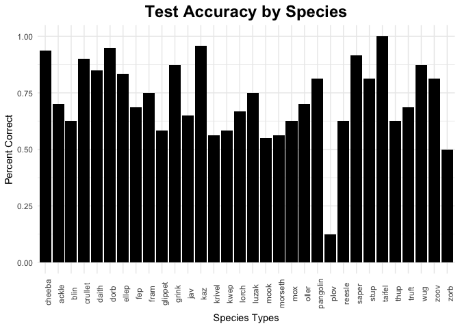

CritterGame\_MP-1\_DataAnalysis\_Pilot\_1
================
Lauren Oey
8/14/2017 (updated 8/22/2017)

Test Accuracy by Game ID and Player
===================================

Test Accuracy by Dyad and Trial Number
======================================

Test Accuracy by Dyad and Distribution
======================================

Test Accuracy by Trial Number
=============================

Test Accuracy by Distribution Condition
=======================================

Test Accuracy by Critter Species
================================

