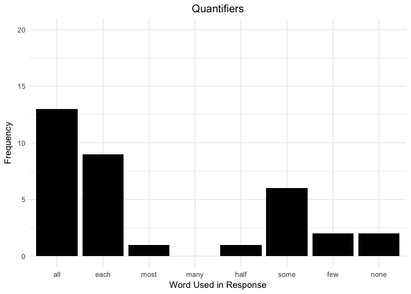
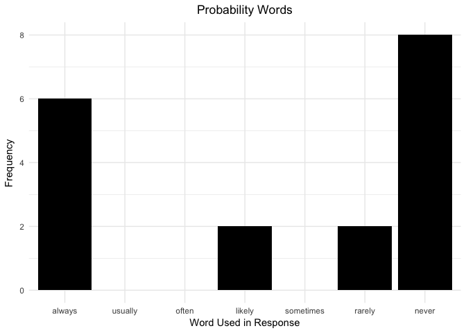
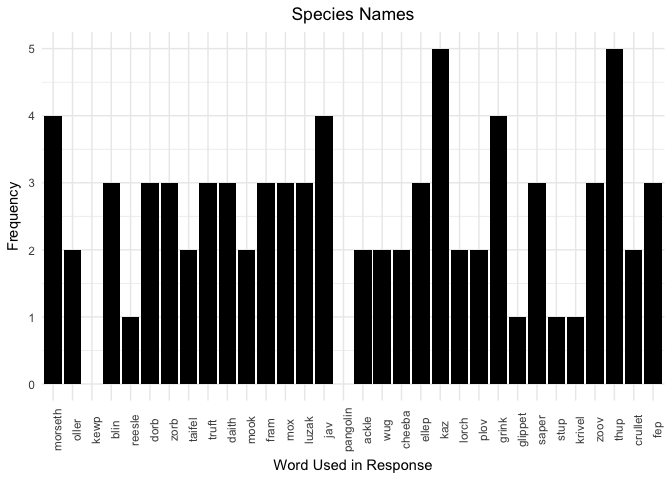
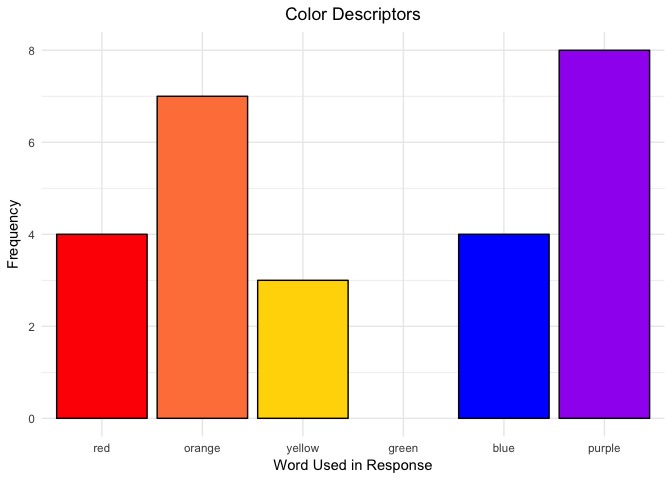
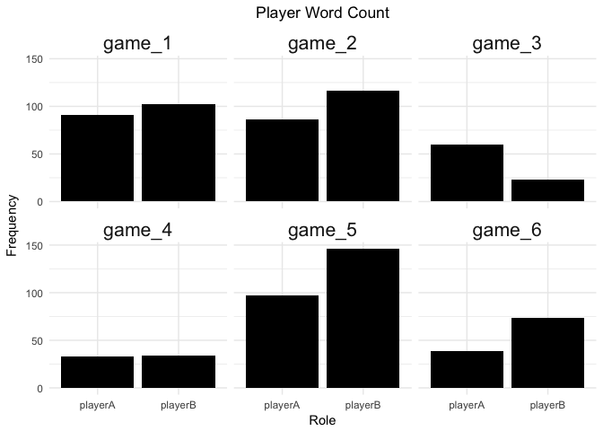
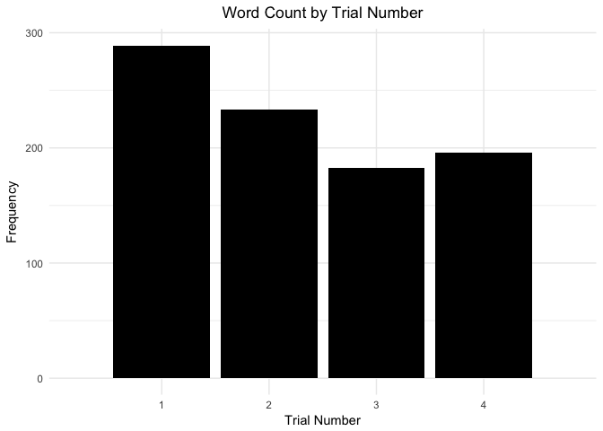

CritterGame\_MP-1\_TextAnalysis\_Pilot\_1
================
Lauren Oey
8/13/2017

Stanford CoreNLP Pre-Processing
===============================

Tokenize Sentences
==================

Tables
======

| distribution      | dyad    |  trialNum| role    | messages                                                                                                                                                                                                                                                                       |  totalCorrect|   hit|    CR|
|:------------------|:--------|---------:|:--------|:-------------------------------------------------------------------------------------------------------------------------------------------------------------------------------------------------------------------------------------------------------------------------------|-------------:|-----:|-----:|
| \[0, 1, 0\]       | game\_1 |         2| playerB | Taifel and oller never lay eggs.; Ellep always lays eggs. ; Okay cool. Ready!                                                                                                                                                                                                  |          1.00|  1.00|  1.00|
| \[0, 1, 0\]       | game\_1 |         3| playerA | Crullet = Always Luzak/Grink = never; kk; k got it                                                                                                                                                                                                                             |          1.00|  1.00|  1.00|
| \[0, 1, 0\]       | game\_2 |         1| playerA | morseth has crocodiles; none others; I think it came in a few colors; all had crocs nearby; sure!                                                                                                                                                                              |          0.00|  0.00|  0.00|
| \[0, 1, 0\]       | game\_2 |         1| playerB | I learned that kaz plants grow leaves and the others do not. Kaz plants are purple.; What color was Morseth?; ok; you ready to continue to the thing?; ok, let's make some money                                                                                               |          1.00|  1.00|  1.00|
| \[0, 1, 0\]       | game\_3 |         1| playerA | kwep, the purple fish, lives near aligators. the other two were blue and red, and do not have any hidden attributes                                                                                                                                                            |          0.42|  0.25|  0.50|
| \[0, 1, 0\]       | game\_3 |         2| playerB | Just taifels lay eggs                                                                                                                                                                                                                                                          |          1.00|  1.00|  1.00|
| \[0, 1, 0\]       | game\_4 |         1| playerA | a zoov lives near crocodiles                                                                                                                                                                                                                                                   |          1.00|  1.00|  1.00|
| \[0, 1, 0\]       | game\_4 |         4| playerB | only daith are posionous; ok                                                                                                                                                                                                                                                   |          1.00|  1.00|  1.00|
| \[0, 1, 0\]       | game\_5 |         3| playerB | Sorry I clicked continue too fast last time!; Only the orange ones this time for me; I agree :); here we go!                                                                                                                                                                   |          1.00|  1.00|  1.00|
| \[0, 1, 0\]       | game\_5 |         4| playerA | only the purple creatures should you be interested in; all of them; ok good; sounds like a plan                                                                                                                                                                                |          1.00|  1.00|  1.00|
| \[0, 1, 0\]       | game\_6 |         2| playerB | javs lay eggs, the other two didn't; k thanx                                                                                                                                                                                                                                   |          1.00|  1.00|  1.00|
| \[0, 1, 0\]       | game\_6 |         3| playerA | only wug                                                                                                                                                                                                                                                                       |          1.00|  1.00|  1.00|
| \[0, 1, 0.75\]    | game\_1 |         2| playerA | Krivel is poisonus 3/4 time; Dorb is always poisonus; Other one ( i missed name so sorry) is never ; yup yup                                                                                                                                                                   |          0.83|  0.86|  0.80|
| \[0, 1, 0.75\]    | game\_1 |         3| playerB | blin lives near crocs; mook never live near crocs; zorb lives near crocs 3/4 of the time (from left to right starting at top, first two are yes, third is no, fourth is yes); lmk if that makes sense; Okay!                                                                   |          0.83|  0.86|  0.80|
| \[0, 1, 0.75\]    | game\_2 |         2| playerA | orange crullet is poisonous; yellow mox is likely to be, but not every time; each bird is equally likely you mean?; k gotcha; yep!                                                                                                                                             |          0.83|  0.86|  0.80|
| \[0, 1, 0.75\]    | game\_2 |         4| playerB | thup poisonous 100%, fram 3/4 of the time, wug never poisonous; ok, rdy?                                                                                                                                                                                                       |          0.50|  0.57|  0.40|
| \[0, 1, 0.75\]    | game\_3 |         3| playerB | Mooks and reisels are near crocodiles.                                                                                                                                                                                                                                         |          0.92|  1.00|  0.80|
| \[0, 1, 0.75\]    | game\_3 |         4| playerA | fram and daith have the attribute                                                                                                                                                                                                                                              |          0.92|  1.00|  0.80|
| \[0, 1, 0.75\]    | game\_4 |         2| playerB | cheeba and fram have eggs. thup don't                                                                                                                                                                                                                                          |          0.92|  1.00|  0.80|
| \[0, 1, 0.75\]    | game\_4 |         4| playerA | all eleps and most sapers grow eggs                                                                                                                                                                                                                                            |          0.92|  1.00|  0.80|
| \[0, 1, 0.75\]    | game\_5 |         2| playerA | oh wow; i had an orange creature and he was poisonous, so were all the purple ones; all of them, yes; yes                                                                                                                                                                      |          0.92|  1.00|  0.80|
| \[0, 1, 0.75\]    | game\_5 |         4| playerB | This time all the blue loorches are poisonous; and 3 out of 4 purple dorbs are poisonous; might as well go for all the blues and purples; kk good luck!                                                                                                                        |          0.92|  1.00|  0.80|
| \[0, 1, 0.75\]    | game\_6 |         1| playerA | Hi, dorb fish do not live near crocodiles; morseth do; blin sometime do; yes; what is the name of the third one in your group; ok                                                                                                                                              |          0.92|  0.86|  1.00|
| \[0, 1, 0.75\]    | game\_6 |         3| playerB | all ollers, some kaz and none of the third; k ty                                                                                                                                                                                                                               |          0.92|  0.86|  1.00|
| \[0, 1, 0.25\]    | game\_1 |         1| playerA | Ackle and Mox Don't live near crocs; Feb always live near crocs (Feb is the special ones); kk ready when you are                                                                                                                                                               |          0.92|  0.80|  1.00|
| \[0, 1, 0.25\]    | game\_1 |         1| playerB | zoov always grow leaves. kaz never grows leaves.; jav grows leaves 1/4 times; I'm ready :)                                                                                                                                                                                     |          0.83|  0.80|  0.86|
| \[0, 1, 0.25\]    | game\_2 |         3| playerA | red luzak and orange stup have leaves; those were the only ones I saw; OK, zorb always, zaper rarely, jav never, got it                                                                                                                                                        |          0.75|  1.00|  0.57|
| \[0, 1, 0.25\]    | game\_2 |         3| playerB | zorb is near crocs, zaper is very very rarely near crocs (1/4 near crocs), and jav is never near crocs                                                                                                                                                                         |          1.00|  1.00|  1.00|
| \[0, 1, 0.25\]    | game\_3 |         1| playerB | Cheebas grow leaves, while the others do not                                                                                                                                                                                                                                   |          0.92|  0.80|  1.00|
| \[0, 1, 0.25\]    | game\_3 |         2| playerA | Mox, the red bug is poisonous. 1/4 of the orange guys are poisonous too; didn't catch the name                                                                                                                                                                                 |          0.92|  1.00|  0.86|
| \[0, 1, 0.25\]    | game\_4 |         1| playerB | kaz and jav colelct leaves                                                                                                                                                                                                                                                     |          0.75|  1.00|  0.57|
| \[0, 1, 0.25\]    | game\_4 |         3| playerA | NA                                                                                                                                                                                                                                                                             |          0.58|  1.00|  0.29|
| \[0, 1, 0.25\]    | game\_5 |         2| playerB | This is what I saw this time; Thup – Yellow – Egg property (4 out of 4) ; Ackle – Blue – NO Egg property (0 out of 4); Ellep – Orange – Egg property (1 out of 4); consistently?; All orange and all purple?                                                                   |          0.25|  0.20|  0.29|
| \[0, 1, 0.25\]    | game\_5 |         3| playerA | only the truts grow leaves in this case; its ok; oh ok cool; seems like we got this                                                                                                                                                                                            |          0.92|  0.80|  1.00|
| \[0, 1, 0.25\]    | game\_6 |         1| playerB | hi, all grinks, some trufts, and some of the third can't remember the name; so i should pick mainly morseth no dorbs and some blin?; k cya in a few, sorry i don't remember; just favor grunks; trufts 2nd                                                                     |          0.75|  0.80|  0.71|
| \[0, 1, 0.25\]    | game\_6 |         2| playerA | stick with plov, some kwep, no fep                                                                                                                                                                                                                                             |          0.25|  0.00|  0.43|
| \[0.5, 0.5, 0.5\] | game\_1 |         4| playerA | k this one tricky; starting from top and left to right like you did....; Lorch is 2nd one and 4th one; Thup is 1, 2, and 4; Cheeba is 1 and 3; does that make sense?; yup ; ready; gg                                                                                          |          0.58|  0.67|  0.50|
| \[0.5, 0.5, 0.5\] | game\_1 |         4| playerB | Yep!; Mine is tricky too.; daith - 1/4 of the time (3rd one); kwep - 2/4 (1st and 4th); plov - 2/4 (2nd and 3rd); make sense?; me too, and you too!!!                                                                                                                          |          0.25|  0.17|  0.33|
| \[0.5, 0.5, 0.5\] | game\_2 |         2| playerB | This time I was shown birds. for every one shown they have a 50% chance to lay an egg.; no, each bird lays an egg 50% of the time; there is a 50% chance that the bird will lay an eeg regardless of name or color; ok, ready?                                                 |          0.50|  1.00|  0.00|
| \[0.5, 0.5, 0.5\] | game\_2 |         4| playerA | OK. red grink yellow zoov and purple truft lay eggs 50% of the time. 2/4 in all cases; u bet                                                                                                                                                                                   |          0.50|  0.00|  1.00|
| \[0.5, 0.5, 0.5\] | game\_3 |         3| playerA | two of each have the attribute, pick them until you've found 2 from each                                                                                                                                                                                                       |          0.50|  0.50|  0.50|
| \[0.5, 0.5, 0.5\] | game\_3 |         4| playerB | Half of each are poisonous                                                                                                                                                                                                                                                     |          0.25|  0.50|  0.00|
| \[0.5, 0.5, 0.5\] | game\_4 |         2| playerA | at least two members of each creature are poisonous; it will be difficult to determine which ones are the poison ones                                                                                                                                                          |          0.33|  0.50|  0.17|
| \[0.5, 0.5, 0.5\] | game\_4 |         3| playerB | one of each has eggs, but it's hard to tell. so i guess randomly pick every other                                                                                                                                                                                              |          0.33|  0.33|  0.33|
| \[0.5, 0.5, 0.5\] | game\_5 |         1| playerA | yeah i did not see a consistency in the types i saw; yes it was that but i did not have those kinds of creatures; mine were moreso involved in crocodiles; yeah whenever you are; you as well                                                                                  |          0.50|  0.50|  0.50|
| \[0.5, 0.5, 0.5\] | game\_5 |         1| playerB | Hi There; I saw 3 types of things, plovs, glippets and luzaks; There were 4 of each type, and each type had a 50% chance of having a clover property; was it a 50% chance like for me?; very cool; OK I am ready, I will just guess 50% for yours; Ready to go?; ok good luck! |          0.50|  0.50|  0.50|
| \[0.5, 0.5, 0.5\] | game\_6 |         4| playerA | all were 50/50                                                                                                                                                                                                                                                                 |          0.50|  0.50|  0.50|
| \[0.5, 0.5, 0.5\] | game\_6 |         4| playerB | this is a tough one, yeah what you said, it's a dice roll good luck.                                                                                                                                                                                                           |          0.83|  0.83|  0.83|

Binning Accuracy
================

    ## # A tibble: 767 x 6
    ## # Groups:   gameid_num, trialNum, role [48]
    ##    gameid_num trialNum    role   word     n totalWords
    ##        <fctr>    <dbl>  <fctr>  <chr> <int>      <int>
    ##  1     game_1        4 playerA    and     4         39
    ##  2     game_2        3 playerB  crocs     4         21
    ##  3     game_2        3 playerB   near     4         21
    ##  4     game_5        2 playerB      4     4         38
    ##  5     game_1        1 playerB leaves     3         16
    ##  6     game_1        2 playerA     is     3         21
    ##  7     game_1        3 playerB  crocs     3         41
    ##  8     game_1        3 playerB   near     3         41
    ##  9     game_1        4 playerA     is     3         39
    ## 10     game_1        4 playerA    one     3         39
    ## # ... with 757 more rows

    ## # A tibble: 9 x 3
    ## # Groups:   distribution [?]
    ##      distribution accuracyBin totalWords
    ##             <chr>       <chr>      <int>
    ## 1    [0, 1, 0.25]   lower_bin        112
    ## 2    [0, 1, 0.25]   upper_bin        104
    ## 3    [0, 1, 0.75]   lower_bin        100
    ## 4    [0, 1, 0.75]   upper_bin        115
    ## 5       [0, 1, 0]   lower_bin         39
    ## 6       [0, 1, 0]   upper_bin        119
    ## 7 [0.5, 0.5, 0.5]   lower_bin         75
    ## 8 [0.5, 0.5, 0.5]   upper_bin        236
    ## 9            <NA>        <NA>          1

| distribution      | accuracyBin | dyad    |  trialNum| role    | messages                                                                                                                                                                                                                                                                       |  totalCorrect|   hit|    CR|
|:------------------|:------------|:--------|---------:|:--------|:-------------------------------------------------------------------------------------------------------------------------------------------------------------------------------------------------------------------------------------------------------------------------------|-------------:|-----:|-----:|
| \[0, 1, 0\]       | upper\_bin  | game\_1 |         2| playerB | Taifel and oller never lay eggs.; Ellep always lays eggs. ; Okay cool. Ready!                                                                                                                                                                                                  |          1.00|  1.00|  1.00|
| \[0, 1, 0\]       | upper\_bin  | game\_1 |         3| playerA | Crullet = Always Luzak/Grink = never; kk; k got it                                                                                                                                                                                                                             |          1.00|  1.00|  1.00|
| \[0, 1, 0\]       | upper\_bin  | game\_2 |         1| playerB | I learned that kaz plants grow leaves and the others do not. Kaz plants are purple.; What color was Morseth?; ok; you ready to continue to the thing?; ok, let's make some money                                                                                               |          1.00|  1.00|  1.00|
| \[0, 1, 0\]       | upper\_bin  | game\_3 |         2| playerB | Just taifels lay eggs                                                                                                                                                                                                                                                          |          1.00|  1.00|  1.00|
| \[0, 1, 0\]       | upper\_bin  | game\_4 |         1| playerA | a zoov lives near crocodiles                                                                                                                                                                                                                                                   |          1.00|  1.00|  1.00|
| \[0, 1, 0\]       | upper\_bin  | game\_4 |         4| playerB | only daith are posionous; ok                                                                                                                                                                                                                                                   |          1.00|  1.00|  1.00|
| \[0, 1, 0\]       | upper\_bin  | game\_5 |         3| playerB | Sorry I clicked continue too fast last time!; Only the orange ones this time for me; I agree :); here we go!                                                                                                                                                                   |          1.00|  1.00|  1.00|
| \[0, 1, 0\]       | upper\_bin  | game\_5 |         4| playerA | only the purple creatures should you be interested in; all of them; ok good; sounds like a plan                                                                                                                                                                                |          1.00|  1.00|  1.00|
| \[0, 1, 0\]       | upper\_bin  | game\_6 |         2| playerB | javs lay eggs, the other two didn't; k thanx                                                                                                                                                                                                                                   |          1.00|  1.00|  1.00|
| \[0, 1, 0\]       | upper\_bin  | game\_6 |         3| playerA | only wug                                                                                                                                                                                                                                                                       |          1.00|  1.00|  1.00|
| \[0, 1, 0\]       | lower\_bin  | game\_3 |         1| playerA | kwep, the purple fish, lives near aligators. the other two were blue and red, and do not have any hidden attributes                                                                                                                                                            |          0.42|  0.25|  0.50|
| \[0, 1, 0\]       | lower\_bin  | game\_2 |         1| playerA | morseth has crocodiles; none others; I think it came in a few colors; all had crocs nearby; sure!                                                                                                                                                                              |          0.00|  0.00|  0.00|
| \[0, 1, 0.75\]    | upper\_bin  | game\_3 |         3| playerB | Mooks and reisels are near crocodiles.                                                                                                                                                                                                                                         |          0.92|  1.00|  0.80|
| \[0, 1, 0.75\]    | upper\_bin  | game\_3 |         4| playerA | fram and daith have the attribute                                                                                                                                                                                                                                              |          0.92|  1.00|  0.80|
| \[0, 1, 0.75\]    | upper\_bin  | game\_4 |         2| playerB | cheeba and fram have eggs. thup don't                                                                                                                                                                                                                                          |          0.92|  1.00|  0.80|
| \[0, 1, 0.75\]    | upper\_bin  | game\_4 |         4| playerA | all eleps and most sapers grow eggs                                                                                                                                                                                                                                            |          0.92|  1.00|  0.80|
| \[0, 1, 0.75\]    | upper\_bin  | game\_5 |         2| playerA | oh wow; i had an orange creature and he was poisonous, so were all the purple ones; all of them, yes; yes                                                                                                                                                                      |          0.92|  1.00|  0.80|
| \[0, 1, 0.75\]    | upper\_bin  | game\_5 |         4| playerB | This time all the blue loorches are poisonous; and 3 out of 4 purple dorbs are poisonous; might as well go for all the blues and purples; kk good luck!                                                                                                                        |          0.92|  1.00|  0.80|
| \[0, 1, 0.75\]    | upper\_bin  | game\_6 |         1| playerA | Hi, dorb fish do not live near crocodiles; morseth do; blin sometime do; yes; what is the name of the third one in your group; ok                                                                                                                                              |          0.92|  0.86|  1.00|
| \[0, 1, 0.75\]    | upper\_bin  | game\_6 |         3| playerB | all ollers, some kaz and none of the third; k ty                                                                                                                                                                                                                               |          0.92|  0.86|  1.00|
| \[0, 1, 0.75\]    | lower\_bin  | game\_1 |         2| playerA | Krivel is poisonus 3/4 time; Dorb is always poisonus; Other one ( i missed name so sorry) is never ; yup yup                                                                                                                                                                   |          0.83|  0.86|  0.80|
| \[0, 1, 0.75\]    | lower\_bin  | game\_1 |         3| playerB | blin lives near crocs; mook never live near crocs; zorb lives near crocs 3/4 of the time (from left to right starting at top, first two are yes, third is no, fourth is yes); lmk if that makes sense; Okay!                                                                   |          0.83|  0.86|  0.80|
| \[0, 1, 0.75\]    | lower\_bin  | game\_2 |         2| playerA | orange crullet is poisonous; yellow mox is likely to be, but not every time; each bird is equally likely you mean?; k gotcha; yep!                                                                                                                                             |          0.83|  0.86|  0.80|
| \[0, 1, 0.75\]    | lower\_bin  | game\_2 |         4| playerB | thup poisonous 100%, fram 3/4 of the time, wug never poisonous; ok, rdy?                                                                                                                                                                                                       |          0.50|  0.57|  0.40|
| \[0, 1, 0.25\]    | upper\_bin  | game\_2 |         3| playerB | zorb is near crocs, zaper is very very rarely near crocs (1/4 near crocs), and jav is never near crocs                                                                                                                                                                         |          1.00|  1.00|  1.00|
| \[0, 1, 0.25\]    | upper\_bin  | game\_1 |         1| playerA | Ackle and Mox Don't live near crocs; Feb always live near crocs (Feb is the special ones); kk ready when you are                                                                                                                                                               |          0.92|  0.80|  1.00|
| \[0, 1, 0.25\]    | upper\_bin  | game\_3 |         1| playerB | Cheebas grow leaves, while the others do not                                                                                                                                                                                                                                   |          0.92|  0.80|  1.00|
| \[0, 1, 0.25\]    | upper\_bin  | game\_3 |         2| playerA | Mox, the red bug is poisonous. 1/4 of the orange guys are poisonous too; didn't catch the name                                                                                                                                                                                 |          0.92|  1.00|  0.86|
| \[0, 1, 0.25\]    | upper\_bin  | game\_5 |         3| playerA | only the truts grow leaves in this case; its ok; oh ok cool; seems like we got this                                                                                                                                                                                            |          0.92|  0.80|  1.00|
| \[0, 1, 0.25\]    | upper\_bin  | game\_1 |         1| playerB | zoov always grow leaves. kaz never grows leaves.; jav grows leaves 1/4 times; I'm ready :)                                                                                                                                                                                     |          0.83|  0.80|  0.86|
| \[0, 1, 0.25\]    | lower\_bin  | game\_2 |         3| playerA | red luzak and orange stup have leaves; those were the only ones I saw; OK, zorb always, zaper rarely, jav never, got it                                                                                                                                                        |          0.75|  1.00|  0.57|
| \[0, 1, 0.25\]    | lower\_bin  | game\_4 |         1| playerB | kaz and jav colelct leaves                                                                                                                                                                                                                                                     |          0.75|  1.00|  0.57|
| \[0, 1, 0.25\]    | lower\_bin  | game\_6 |         1| playerB | hi, all grinks, some trufts, and some of the third can't remember the name; so i should pick mainly morseth no dorbs and some blin?; k cya in a few, sorry i don't remember; just favor grunks; trufts 2nd                                                                     |          0.75|  0.80|  0.71|
| \[0, 1, 0.25\]    | lower\_bin  | game\_4 |         3| playerA | NA                                                                                                                                                                                                                                                                             |          0.58|  1.00|  0.29|
| \[0, 1, 0.25\]    | lower\_bin  | game\_5 |         2| playerB | This is what I saw this time; Thup – Yellow – Egg property (4 out of 4) ; Ackle – Blue – NO Egg property (0 out of 4); Ellep – Orange – Egg property (1 out of 4); consistently?; All orange and all purple?                                                                   |          0.25|  0.20|  0.29|
| \[0, 1, 0.25\]    | lower\_bin  | game\_6 |         2| playerA | stick with plov, some kwep, no fep                                                                                                                                                                                                                                             |          0.25|  0.00|  0.43|
| \[0.5, 0.5, 0.5\] | upper\_bin  | game\_6 |         4| playerB | this is a tough one, yeah what you said, it's a dice roll good luck.                                                                                                                                                                                                           |          0.83|  0.83|  0.83|
| \[0.5, 0.5, 0.5\] | upper\_bin  | game\_1 |         4| playerA | k this one tricky; starting from top and left to right like you did....; Lorch is 2nd one and 4th one; Thup is 1, 2, and 4; Cheeba is 1 and 3; does that make sense?; yup ; ready; gg                                                                                          |          0.58|  0.67|  0.50|
| \[0.5, 0.5, 0.5\] | upper\_bin  | game\_2 |         2| playerB | This time I was shown birds. for every one shown they have a 50% chance to lay an egg.; no, each bird lays an egg 50% of the time; there is a 50% chance that the bird will lay an eeg regardless of name or color; ok, ready?                                                 |          0.50|  1.00|  0.00|
| \[0.5, 0.5, 0.5\] | upper\_bin  | game\_2 |         4| playerA | OK. red grink yellow zoov and purple truft lay eggs 50% of the time. 2/4 in all cases; u bet                                                                                                                                                                                   |          0.50|  0.00|  1.00|
| \[0.5, 0.5, 0.5\] | upper\_bin  | game\_3 |         3| playerA | two of each have the attribute, pick them until you've found 2 from each                                                                                                                                                                                                       |          0.50|  0.50|  0.50|
| \[0.5, 0.5, 0.5\] | upper\_bin  | game\_5 |         1| playerA | yeah i did not see a consistency in the types i saw; yes it was that but i did not have those kinds of creatures; mine were moreso involved in crocodiles; yeah whenever you are; you as well                                                                                  |          0.50|  0.50|  0.50|
| \[0.5, 0.5, 0.5\] | upper\_bin  | game\_5 |         1| playerB | Hi There; I saw 3 types of things, plovs, glippets and luzaks; There were 4 of each type, and each type had a 50% chance of having a clover property; was it a 50% chance like for me?; very cool; OK I am ready, I will just guess 50% for yours; Ready to go?; ok good luck! |          0.50|  0.50|  0.50|
| \[0.5, 0.5, 0.5\] | upper\_bin  | game\_6 |         4| playerA | all were 50/50                                                                                                                                                                                                                                                                 |          0.50|  0.50|  0.50|
| \[0.5, 0.5, 0.5\] | lower\_bin  | game\_4 |         2| playerA | at least two members of each creature are poisonous; it will be difficult to determine which ones are the poison ones                                                                                                                                                          |          0.33|  0.50|  0.17|
| \[0.5, 0.5, 0.5\] | lower\_bin  | game\_4 |         3| playerB | one of each has eggs, but it's hard to tell. so i guess randomly pick every other                                                                                                                                                                                              |          0.33|  0.33|  0.33|
| \[0.5, 0.5, 0.5\] | lower\_bin  | game\_1 |         4| playerB | Yep!; Mine is tricky too.; daith - 1/4 of the time (3rd one); kwep - 2/4 (1st and 4th); plov - 2/4 (2nd and 3rd); make sense?; me too, and you too!!!                                                                                                                          |          0.25|  0.17|  0.33|
| \[0.5, 0.5, 0.5\] | lower\_bin  | game\_3 |         4| playerB | Half of each are poisonous                                                                                                                                                                                                                                                     |          0.25|  0.50|  0.00|

Word Count
==========


Context Word Count
==================

Both Conditions Combined
------------------------

    ## Joining, by = "word"


By Distribution Condition
-------------------------

    ## Joining, by = "word"


Context Words by Word Type
==========================

    ## Joining, by = "word"


By Distribution Condition
-------------------------

    ## Joining, by = "word"


Quantifiers Word Count
======================

Both Conditions Combined
------------------------


By Distribution
---------------

``` r
count_quantifiers_byDistr <-  text_df %>%
  unnest_tokens(word, text) %>%
  group_by(distribution) %>%
  count(word, sort=TRUE) %>%
  filter(word %in% quantifier_words) %>%
  group_by(distribution, word) %>%
  summarize(n = sum(n))

quantifiers_byDistr <- ggplot(count_quantifiers_byDistr, aes(x=word, y=n)) +
  geom_bar(stat="identity", fill="black") +
  scale_x_discrete("Word") +
  scale_y_continuous("Counts", expand=c(0,0)) +
  facet_wrap(~distribution) +
  ggtitle("Quantifiers Used by Distribution") +
  theme_classic() + 
  theme(plot.title = element_text(hjust=0.5, size=36, face="bold"),
        axis.title = element_text(size=24),
        axis.text.x = element_text(size=18, angle=90),
        axis.text.y = element_text(size=20))
quantifiers_byDistr
```


Probabilistic Word Count
========================

Both Conditions Combined
------------------------



Conditionals Word Count
=======================

Both Conditions Combined
------------------------


Numeric Word Count
==================



Types Within Categories
=======================

Species Categories
------------------


Colors Categories
-----------------


Internal Property Categories
----------------------------



Total Word Count by Speaker
===========================



Total Word Count by Trial
=========================


Total Word Count by POS
=======================



Total Word Count by Dependencies
================================


