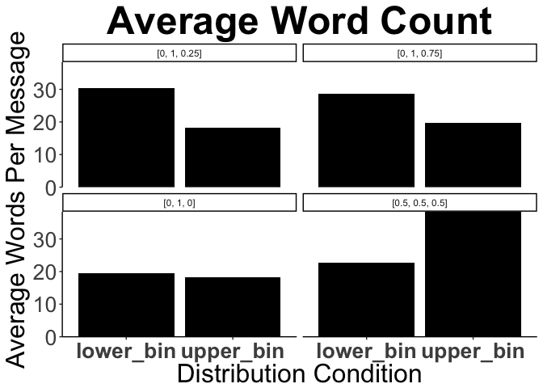

CritterGame\_MP-1\_TextAnalysis\_Pilot\_1
================
Lauren Oey
8/13/2017

Stanford CoreNLP Pre-Processing
===============================

Tokenize Sentences
==================

Tables
======

    ## Joining, by = c("distribution", "dyad", "trialNum", "role")

| distribution      | dyad    |  trialNum| role    |  totalCorrect|   hit|    CR| messages                                                                                                                                                                                                                                                                       |
|:------------------|:--------|---------:|:--------|-------------:|-----:|-----:|:-------------------------------------------------------------------------------------------------------------------------------------------------------------------------------------------------------------------------------------------------------------------------------|
| \[0, 1, 0\]       | game\_1 |         2| playerB |          1.00|  1.00|  1.00| taifel and oller never lay eggs.; ellep always lays eggs. ; okay cool. ready!                                                                                                                                                                                                  |
| \[0, 1, 0\]       | game\_1 |         3| playerA |          1.00|  1.00|  1.00| crullet = always luzak/grink = never; kk; k got it                                                                                                                                                                                                                             |
| \[0, 1, 0\]       | game\_2 |         1| playerA |          0.00|  0.00|  0.00| morseth has crocodiles; none others; i think it came in a few colors; all had crocs nearby; sure!                                                                                                                                                                              |
| \[0, 1, 0\]       | game\_2 |         1| playerB |          1.00|  1.00|  1.00| i learned that kaz plants grow leaves and the others do not. kaz plants are purple.; what color was morseth?; ok; you ready to continue to the thing?; ok, let's make some money                                                                                               |
| \[0, 1, 0\]       | game\_3 |         1| playerA |          0.42|  0.25|  0.50| kwep, the purple fish, lives near alligator. the other two were blue and red, and do not have any hidden attributes                                                                                                                                                            |
| \[0, 1, 0\]       | game\_3 |         2| playerB |          1.00|  1.00|  1.00| just taifels lay eggs                                                                                                                                                                                                                                                          |
| \[0, 1, 0\]       | game\_4 |         1| playerA |          1.00|  1.00|  1.00| a zoov lives near crocodiles                                                                                                                                                                                                                                                   |
| \[0, 1, 0\]       | game\_4 |         4| playerB |          1.00|  1.00|  1.00| only daith are poisonous; ok                                                                                                                                                                                                                                                   |
| \[0, 1, 0\]       | game\_5 |         3| playerB |          1.00|  1.00|  1.00| sorry i clicked continue too fast last time!; only the orange ones this time for me; i agree :); here we go!                                                                                                                                                                   |
| \[0, 1, 0\]       | game\_5 |         4| playerA |          1.00|  1.00|  1.00| only the purple creatures should you be interested in; all of them; ok good; sounds like a plan                                                                                                                                                                                |
| \[0, 1, 0\]       | game\_6 |         2| playerB |          1.00|  1.00|  1.00| javs lay eggs, the other two didn't; k thanx                                                                                                                                                                                                                                   |
| \[0, 1, 0\]       | game\_6 |         3| playerA |          1.00|  1.00|  1.00| only wug                                                                                                                                                                                                                                                                       |
| \[0, 1, 0.75\]    | game\_1 |         2| playerA |          0.83|  0.86|  0.80| krivel is poisonous 3/4 time; dorb is always poisonous; other one ( i missed name so sorry) is never ; yup yup                                                                                                                                                                 |
| \[0, 1, 0.75\]    | game\_1 |         3| playerB |          0.83|  0.86|  0.80| blin lives near crocs; mook never live near crocs; zorb lives near crocs 3/4 of the time (from left to right starting at top, first two are yes, third is no, fourth is yes); lmk if that makes sense; okay!                                                                   |
| \[0, 1, 0.75\]    | game\_2 |         2| playerA |          0.83|  0.86|  0.80| orange crullet is poisonous; yellow mox is likely to be, but not every time; each bird is equally likely you mean?; k gotcha; yep!                                                                                                                                             |
| \[0, 1, 0.75\]    | game\_2 |         4| playerB |          0.50|  0.57|  0.40| thup poisonous 100%, fram 3/4 of the time, wug never poisonous; ok, rdy?                                                                                                                                                                                                       |
| \[0, 1, 0.75\]    | game\_3 |         3| playerB |          0.92|  1.00|  0.80| mooks and reesles are near crocodiles.                                                                                                                                                                                                                                         |
| \[0, 1, 0.75\]    | game\_3 |         4| playerA |          0.92|  1.00|  0.80| fram and daith have the attribute                                                                                                                                                                                                                                              |
| \[0, 1, 0.75\]    | game\_4 |         2| playerB |          0.92|  1.00|  0.80| cheeba and fram have eggs. thup don't                                                                                                                                                                                                                                          |
| \[0, 1, 0.75\]    | game\_4 |         4| playerA |          0.92|  1.00|  0.80| all elleps and most sapers grow eggs                                                                                                                                                                                                                                           |
| \[0, 1, 0.75\]    | game\_5 |         2| playerA |          0.92|  1.00|  0.80| oh wow; i had an orange creature and he was poisonous, so were all the purple ones; all of them, yes; yes                                                                                                                                                                      |
| \[0, 1, 0.75\]    | game\_5 |         4| playerB |          0.92|  1.00|  0.80| this time all the blue lorches are poisonous; and 3 out of 4 purple dorbs are poisonous; might as well go for all the blues and purples; kk good luck!                                                                                                                         |
| \[0, 1, 0.75\]    | game\_6 |         1| playerA |          0.92|  0.86|  1.00| hi, dorb fish do not live near crocodiles; morseth do; blin sometime do; yes; what is the name of the third one in your group; ok                                                                                                                                              |
| \[0, 1, 0.75\]    | game\_6 |         3| playerB |          0.92|  0.86|  1.00| all ollers, some kaz and none of the third; k ty                                                                                                                                                                                                                               |
| \[0, 1, 0.25\]    | game\_1 |         1| playerA |          0.92|  0.80|  1.00| ackle and mox don't live near crocs; fep always live near crocs (fep is the special ones); kk ready when you are                                                                                                                                                               |
| \[0, 1, 0.25\]    | game\_1 |         1| playerB |          0.83|  0.80|  0.86| zoov always grow leaves. kaz never grows leaves.; jav grows leaves 1/4 times; i'm ready :)                                                                                                                                                                                     |
| \[0, 1, 0.25\]    | game\_2 |         3| playerA |          0.75|  1.00|  0.57| red luzak and orange stup have leaves; those were the only ones i saw; ok, zorb always, saper rarely, jav never, got it                                                                                                                                                        |
| \[0, 1, 0.25\]    | game\_2 |         3| playerB |          1.00|  1.00|  1.00| zorb is near crocs, saper is very very rarely near crocs (1/4 near crocs), and jav is never near crocs                                                                                                                                                                         |
| \[0, 1, 0.25\]    | game\_3 |         1| playerB |          0.92|  0.80|  1.00| cheebas grow leaves, while the others do not                                                                                                                                                                                                                                   |
| \[0, 1, 0.25\]    | game\_3 |         2| playerA |          0.92|  1.00|  0.86| mox, the red bug is poisonous. 1/4 of the orange guys are poisonous too; didn't catch the name                                                                                                                                                                                 |
| \[0, 1, 0.25\]    | game\_4 |         1| playerB |          0.75|  1.00|  0.57| kaz and jav collect leaves                                                                                                                                                                                                                                                     |
| \[0, 1, 0.25\]    | game\_5 |         2| playerB |          0.25|  0.20|  0.29| this is what i saw this time; thup – yellow – egg property (4 out of 4) ; ackle – blue – no egg property (0 out of 4); ellep – orange – egg property (1 out of 4); consistently?; all orange and all purple?                                                                   |
| \[0, 1, 0.25\]    | game\_5 |         3| playerA |          0.92|  0.80|  1.00| only the thups grow leaves in this case; its ok; oh ok cool; seems like we got this                                                                                                                                                                                            |
| \[0, 1, 0.25\]    | game\_6 |         1| playerB |          0.75|  0.80|  0.71| hi, all grinks, some trufts, and some of the third can't remember the name; so i should pick mainly morseth no dorbs and some blin?; k cya in a few, sorry i don't remember; just favor grinks; trufts 2nd                                                                     |
| \[0, 1, 0.25\]    | game\_6 |         2| playerA |          0.25|  0.00|  0.43| stick with plov, some kwep, no fep                                                                                                                                                                                                                                             |
| \[0.5, 0.5, 0.5\] | game\_1 |         4| playerA |          0.58|  0.67|  0.50| k this one tricky; starting from top and left to right like you did....; lorch is 2nd one and 4th one; thup is 1, 2, and 4; cheeba is 1 and 3; does that make sense?; yup ; ready; gg                                                                                          |
| \[0.5, 0.5, 0.5\] | game\_1 |         4| playerB |          0.25|  0.17|  0.33| yep!; mine is tricky too.; daith - 1/4 of the time (3rd one); kwep - 2/4 (1st and 4th); plov - 2/4 (2nd and 3rd); make sense?; me too, and you too!!!                                                                                                                          |
| \[0.5, 0.5, 0.5\] | game\_2 |         2| playerB |          0.50|  1.00|  0.00| this time i was shown birds. for every one shown they have a 50% chance to lay an egg.; no, each bird lays an egg 50% of the time; there is a 50% chance that the bird will lay an egg regardless of name or color; ok, ready?                                                 |
| \[0.5, 0.5, 0.5\] | game\_2 |         4| playerA |          0.50|  0.00|  1.00| ok. red grink yellow zoov and purple truft lay eggs 50% of the time. 2/4 in all cases; u bet                                                                                                                                                                                   |
| \[0.5, 0.5, 0.5\] | game\_3 |         3| playerA |          0.50|  0.50|  0.50| two of each have the attribute, pick them until you've found 2 from each                                                                                                                                                                                                       |
| \[0.5, 0.5, 0.5\] | game\_3 |         4| playerB |          0.25|  0.50|  0.00| half of each are poisonous                                                                                                                                                                                                                                                     |
| \[0.5, 0.5, 0.5\] | game\_4 |         2| playerA |          0.33|  0.50|  0.17| at least two members of each creature are poisonous; it will be difficult to determine which ones are the poison ones                                                                                                                                                          |
| \[0.5, 0.5, 0.5\] | game\_4 |         3| playerB |          0.33|  0.33|  0.33| one of each has eggs, but it's hard to tell. so i guess randomly pick every other                                                                                                                                                                                              |
| \[0.5, 0.5, 0.5\] | game\_5 |         1| playerA |          0.50|  0.50|  0.50| yeah i did not see a consistency in the types i saw; yes it was that but i did not have those kinds of creatures; mine were more so involved in crocodiles; yeah whenever you are; you as well                                                                                 |
| \[0.5, 0.5, 0.5\] | game\_5 |         1| playerB |          0.50|  0.50|  0.50| hi there; i saw 3 types of things, plovs, glippets and luzaks; there were 4 of each type, and each type had a 50% chance of having a clover property; was it a 50% chance like for me?; very cool; ok i am ready, i will just guess 50% for yours; ready to go?; ok good luck! |
| \[0.5, 0.5, 0.5\] | game\_6 |         4| playerA |          0.50|  0.50|  0.50| all were 50/50                                                                                                                                                                                                                                                                 |
| \[0.5, 0.5, 0.5\] | game\_6 |         4| playerB |          0.83|  0.83|  0.83| this is a tough one, yeah what you said, it's a dice roll good luck.                                                                                                                                                                                                           |

Word Count
==========

Context Word Count
==================

Both Conditions Combined
------------------------

    ## Joining, by = "word"

By Distribution Condition
-------------------------

    ## Joining, by = "word"

Context Words by Word Type
==========================

    ## Joining, by = "word"

By Distribution Condition
-------------------------

    ## Joining, by = "word"

Quantifiers Word Count
======================

Both Conditions Combined
------------------------

Probabilistic Word Count
========================

Both Conditions Combined
------------------------

Conditionals Word Count
=======================

Both Conditions Combined
------------------------

Numeric Word Count
==================

Types Within Categories
=======================

Species Categories
------------------

Colors Categories
-----------------

Internal Property Categories
----------------------------

Total Word Count by Speaker
===========================

Total Word Count by Trial
=========================

Total Word Count by POS
=======================

Total Word Count by Dependencies
================================

